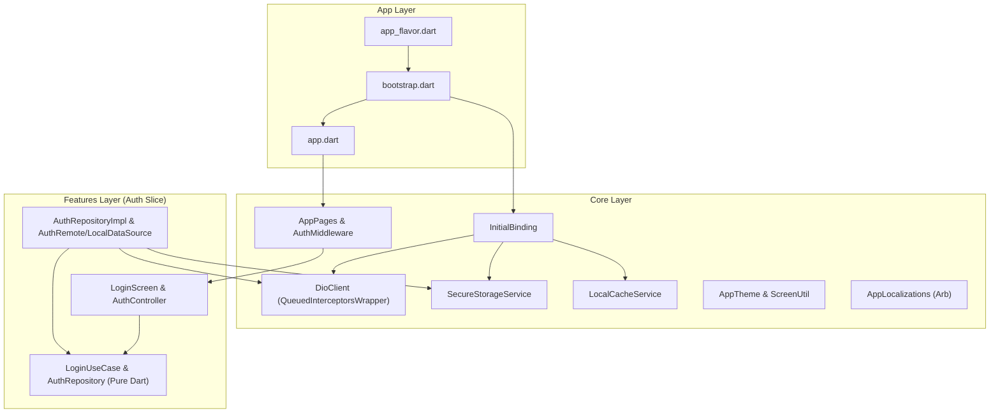

# Flutter Base Project Scaffolding Implementation Plan

> **For agentic workers:** REQUIRED SUB-SKILL: Use superpowers:subagent-driven-development to implement this plan task-by-task. Steps use checkbox (`- [ ]`) syntax for tracking.

**Goal:** Scaffold a production-grade Flutter clean architecture base project for `building_utility_management_system` complete with GetX dependency injection, Queued token refresh, dual storage, official localization, and a reference Auth vertical slice.

**Architecture:** The project employs Clean Architecture with clear layer isolation: `core/` contains cross-cutting infrastructure (network, storage, theme, routing, localization, errors), `app/` manages application bootstrapping and compile-time flavors (`dev`, `staging`, `prod`), and `features/` organizes business capabilities into isolated `domain/`, `data/`, and `presentation/` layers. Dependencies flow strictly inwards, and all dependencies are injected via GetX Bindings.

**Architecture Diagram:**



**Tech Stack:** Flutter 3.x / Dart 3.x, GetX (`get: ^4.6.6`), Dio (`dio: ^5.4.0`), `fpdart: ^1.1.0`, `equatable: ^2.0.5`, `flutter_secure_storage: ^9.2.2`, `hive_flutter: ^1.1.0`, `flutter_screenutil: ^5.9.3`, `intl: ^0.19.0`, `mocktail: ^1.0.4`, `json_serializable: ^6.8.0`.

## Global Constraints

- Exclusively use GetX Bindings (`Get.put`, `Get.lazyPut`, `Get.find`) for dependency injection; strictly ZERO references to `get_it` or `injectable`.
- Token refresh must specify `QueuedInterceptorsWrapper` with an isolated, non-intercepted `_refreshDio` instance to prevent recursive 401 loops.
- Pure Dart domain layer (`domain/`): strictly zero framework imports (`flutter/`, `dio/`, `get/`, `json_annotation`).
- State classes and data models must implement value equality via `Equatable`; strictly ZERO hand-written JSON serialization bodies (use `@JsonSerializable()` with generated `*.g.dart`).
- Strict verification criteria: `flutter analyze --fatal-infos` must yield 0 errors/warnings/infos, and `flutter test` must pass 100% green.

---

### Task 1: Package Matrix, Configuration & Asset Directories Setup

**Files:**
- Modify: `pubspec.yaml`
- Modify: `analysis_options.yaml`
- Create: `l10n.yaml`
- Create: `.env.example`
- Create: `assets/icons/.gitkeep`, `assets/images/.gitkeep`, `assets/env/.gitkeep`

**Interfaces:**
- Consumes: Flutter SDK, Dart SDK >=3.12.2
- Produces: Installed dependencies, linter rules, and asset path registrations

- [ ] **Step 1: Update pubspec.yaml with pinned package dependencies**

Replace dependencies and dev_dependencies in `pubspec.yaml` with the canonical matrix:
```yaml
name: building_utility_management_system
description: "Production Building Utility Management System built on Flutter Clean Architecture."
publish_to: 'none'
version: 1.0.0+1

environment:
  sdk: ^3.12.2

dependencies:
  flutter:
    sdk: flutter
  flutter_localizations:
    sdk: flutter

  # State Management & Routing
  get: ^4.6.6

  # Networking
  dio: ^5.4.0
  connectivity_plus: ^6.0.3

  # Functional Programming & Equality
  fpdart: ^1.1.0
  equatable: ^2.0.5

  # Storage & Caching
  flutter_secure_storage: ^9.2.2
  hive: ^2.2.3
  hive_flutter: ^1.1.0

  # UI, Theming & Typography
  flutter_screenutil: ^5.9.3
  google_fonts: ^6.2.1
  cupertino_icons: ^1.0.8

  # Localization & Formatting
  intl: ^0.19.0

  # Utilities & Environment
  logger: ^2.2.0
  flutter_dotenv: ^5.1.0
  json_annotation: ^4.9.0

dev_dependencies:
  flutter_test:
    sdk: flutter
  flutter_lints: ^6.0.0
  mocktail: ^1.0.4
  build_runner: ^2.4.9
  json_serializable: ^6.8.0

flutter:
  uses-material-design: true
  generate: true
  assets:
    - assets/icons/
    - assets/images/
    - assets/env/
```

- [ ] **Step 2: Create l10n.yaml and configure analysis_options.yaml**

Create `l10n.yaml`:
```yaml
arb-dir: lib/core/localization/l10n
template-arb-file: app_en.arb
output-localization-file: app_localizations.dart
output-dir: lib/core/localization
synthetic-package: false
untranslated-messages-file: untranslated_messages.json
```

Update `analysis_options.yaml` to include strict analysis flags:
```yaml
include: package:flutter_lints/flutter.yaml

analyzer:
  language:
    strict-casts: true
    strict-inference: true
    strict-raw-types: true
  errors:
    missing_required_param: error
    missing_return: error
    todo: ignore

linter:
  rules:
    - prefer_const_constructors
    - prefer_const_declarations
    - avoid_print
    - unawaited_futures
    - always_declare_return_types
```

- [ ] **Step 3: Create asset directories and .env.example**

Create directory structure:
```bash
mkdir -p assets/icons assets/images assets/env
touch assets/icons/.gitkeep assets/images/.gitkeep assets/env/.gitkeep
```

Create `.env.example`:
```env
API_BASE_URL=https://api.dev.example.com
APP_NAME=Building Utility Management (Dev)
```

- [ ] **Step 4: Run dependency installation**

Run: `flutter pub get`  
Expected: `Got dependencies!` (status 0).

- [ ] **Step 5: Commit**

```bash
git add pubspec.yaml analysis_options.yaml l10n.yaml .env.example assets/
git commit -m "chore: setup project package matrix, linter rules, and asset directories"
```

---

### Task 2: Core Base, Constants, Error Handling & Storage Services

**Files:**
- Create: `lib/core/base/view_state.dart`
- Create: `lib/core/constants/api_endpoints.dart`
- Create: `lib/core/constants/app_assets.dart`
- Create: `lib/core/constants/storage_keys.dart`
- Create: `lib/core/error/exceptions.dart`
- Create: `lib/core/error/failures.dart`
- Create: `lib/core/storage/secure_storage_service.dart`
- Create: `lib/core/storage/local_cache_service.dart`
- Create: `test/core/base/view_state_test.dart`
- Create: `test/core/storage/secure_storage_service_test.dart`

**Interfaces:**
- Consumes: `equatable`, `flutter_secure_storage`, `hive_flutter`
- Produces: `ViewState` hierarchy, `Failure` hierarchy, `SecureStorageService`, `LocalCacheService`

- [ ] **Step 1: Write tests for ViewState equality and SecureStorageService**

Create `test/core/base/view_state_test.dart`:
```dart
import 'package:building_utility_management_system/core/base/view_state.dart';
import 'package:flutter_test/flutter_test.dart';

void main() {
  group('ViewState', () {
    test('IdleState equality works', () {
      expect(const IdleState(), equals(const IdleState()));
    });

    test('LoadingState equality works', () {
      expect(const LoadingState(), equals(const LoadingState()));
    });

    test('SuccessState equality works with data', () {
      expect(const SuccessState<String>('data'), equals(const SuccessState<String>('data')));
      expect(const SuccessState<String>('data1'), isNot(equals(const SuccessState<String>('data2'))));
    });

    test('ErrorState equality works with message', () {
      expect(const ErrorState('error'), equals(const ErrorState('error')));
    });
  });
}
```

Create `test/core/storage/secure_storage_service_test.dart`:
```dart
import 'package:building_utility_management_system/core/storage/secure_storage_service.dart';
import 'package:flutter_secure_storage/flutter_secure_storage.dart';
import 'package:flutter_test/flutter_test.dart';
import 'package:mocktail/mocktail.dart';

class MockFlutterSecureStorage extends Mock implements FlutterSecureStorage {}

void main() {
  late MockFlutterSecureStorage mockStorage;
  late SecureStorageService service;

  setUp(() {
    mockStorage = MockFlutterSecureStorage();
    service = SecureStorageService(storage: mockStorage);
  });

  test('saveTokens caches accessToken in-memory and writes to secure storage', () async {
    when(() => mockStorage.write(key: any(named: 'key'), value: any(named: 'value')))
        .thenAnswer((_) async {});

    await service.saveTokens(accessToken: 'token123', refreshToken: 'refresh456');

    expect(service.hasToken, isTrue);
    expect(service.cachedAccessToken, equals('token123'));
    verify(() => mockStorage.write(key: 'auth_token', value: 'token123')).called(1);
    verify(() => mockStorage.write(key: 'refresh_token', value: 'refresh456')).called(1);
  });

  test('clearTokens removes cached accessToken and deletes keys in storage', () async {
    when(() => mockStorage.delete(key: any(named: 'key'))).thenAnswer((_) async {});

    await service.clearTokens();

    expect(service.hasToken, isFalse);
    expect(service.cachedAccessToken, isNull);
    verify(() => mockStorage.delete(key: 'auth_token')).called(1);
    verify(() => mockStorage.delete(key: 'refresh_token')).called(1);
  });
}
```

- [ ] **Step 2: Run tests to verify they fail**

Run: `flutter test test/core/base/view_state_test.dart test/core/storage/secure_storage_service_test.dart`  
Expected: Compilation failure because files do not exist yet.

- [ ] **Step 3: Implement core base, constants, errors, and storage services**

Create `lib/core/base/view_state.dart`:
```dart
import 'package:equatable/equatable.dart';

sealed class ViewState extends Equatable {
  const ViewState();
  @override
  List<Object?> get props => [];
}

class IdleState extends ViewState {
  const IdleState();
}

class LoadingState extends ViewState {
  const LoadingState();
}

class SuccessState<T> extends ViewState {
  final T data;
  const SuccessState(this.data);
  @override
  List<Object?> get props => [data];
}

class ErrorState extends ViewState {
  final String message;
  const ErrorState(this.message);
  @override
  List<Object?> get props => [message];
}
```

Create `lib/core/constants/api_endpoints.dart`:
```dart
abstract class ApiEndpoints {
  static const login = '/auth/login';
  static const refreshToken = '/auth/refresh';
  static const userProfile = '/users/profile';
}
```

Create `lib/core/constants/app_assets.dart`:
```dart
abstract class AppAssets {
  static const iconsPath = 'assets/icons/';
  static const imagesPath = 'assets/images/';
}
```

Create `lib/core/constants/storage_keys.dart`:
```dart
abstract class StorageKeys {
  static const authToken = 'auth_token';
  static const refreshToken = 'refresh_token';
  static const appBox = 'app_cache_box';
  static const themeMode = 'theme_mode';
  static const appLocale = 'app_locale';
  static const userProfile = 'cached_user_profile';
}
```

Create `lib/core/error/exceptions.dart`:
```dart
class ServerException implements Exception {
  final String message;
  final int? statusCode;
  const ServerException([this.message = 'A server error occurred', this.statusCode]);
}

class CacheException implements Exception {
  final String message;
  const CacheException([this.message = 'Failed to access cache']);
}

class NetworkException implements Exception {
  final String message;
  const NetworkException([this.message = 'No internet connection']);
}
```

Create `lib/core/error/failures.dart`:
```dart
import 'package:equatable/equatable.dart';

abstract class Failure extends Equatable {
  final String message;
  const Failure(this.message);

  @override
  List<Object?> get props => [message];
}

class ServerFailure extends Failure {
  const ServerFailure([super.message = 'A server error occurred. Please try again.']);
}

class NetworkFailure extends Failure {
  const NetworkFailure([super.message = 'No internet connection detected.']);
}

class CacheFailure extends Failure {
  const CacheFailure([super.message = 'Failed to load cached data.']);
}

class AuthFailure extends Failure {
  const AuthFailure([super.message = 'Authentication failed. Please sign in again.']);
}

class ValidationFailure extends Failure {
  const ValidationFailure(super.message);
}
```

Create `lib/core/storage/secure_storage_service.dart`:
```dart
import 'package:flutter_secure_storage/flutter_secure_storage.dart';
import '../constants/storage_keys.dart';

class SecureStorageService {
  final FlutterSecureStorage _storage;
  String? _cachedAccessToken;

  SecureStorageService({FlutterSecureStorage? storage})
      : _storage = storage ?? const FlutterSecureStorage();

  bool get hasToken => _cachedAccessToken != null && _cachedAccessToken!.isNotEmpty;
  String? get cachedAccessToken => _cachedAccessToken;

  Future<void> init() async {
    _cachedAccessToken = await _storage.read(key: StorageKeys.authToken);
  }

  Future<String?> getAccessToken() async {
    _cachedAccessToken = await _storage.read(key: StorageKeys.authToken);
    return _cachedAccessToken;
  }

  Future<String?> getRefreshToken() async {
    return _storage.read(key: StorageKeys.refreshToken);
  }

  Future<void> saveTokens({
    required String accessToken,
    required String refreshToken,
  }) async {
    _cachedAccessToken = accessToken;
    await _storage.write(key: StorageKeys.authToken, value: accessToken);
    await _storage.write(key: StorageKeys.refreshToken, value: refreshToken);
  }

  Future<void> clearTokens() async {
    _cachedAccessToken = null;
    await _storage.delete(key: StorageKeys.authToken);
    await _storage.delete(key: StorageKeys.refreshToken);
  }
}
```

Create `lib/core/storage/local_cache_service.dart`:
```dart
import 'package:hive_flutter/hive_flutter.dart';
import '../constants/storage_keys.dart';

class LocalCacheService {
  Box<dynamic>? _box;

  Future<void> init() async {
    _box = await Hive.openBox<dynamic>(StorageKeys.appBox);
  }

  T? get<T>(String key, {T? defaultValue}) {
    return _box?.get(key, defaultValue: defaultValue) as T?;
  }

  Future<void> put<T>(String key, T value) async {
    await _box?.put(key, value);
  }

  Future<void> delete(String key) async {
    await _box?.delete(key);
  }

  Future<void> clearAll() async {
    await _box?.clear();
  }
}
```

- [ ] **Step 4: Run unit tests to verify they pass**

Run: `flutter test test/core/base/view_state_test.dart test/core/storage/secure_storage_service_test.dart`  
Expected: All tests pass (green).

- [ ] **Step 5: Commit**

```bash
git add lib/core/base/ lib/core/constants/ lib/core/error/ lib/core/storage/ test/core/
git commit -m "feat(core): implement base state, constants, failures, and storage services"
```

---

### Task 3: Core Network Infrastructure & Queued Token Refresh

**Files:**
- Create: `lib/core/network/network_info.dart`
- Create: `lib/core/network/interceptors/connectivity_interceptor.dart`
- Create: `lib/core/network/interceptors/auth_interceptor.dart`
- Create: `lib/core/network/interceptors/logging_interceptor.dart`
- Create: `lib/core/network/interceptors/error_interceptor.dart`
- Create: `lib/core/network/dio_client.dart`
- Create: `test/core/network/error_interceptor_test.dart`

**Interfaces:**
- Consumes: `dio`, `connectivity_plus`, `fpdart`, `SecureStorageService`
- Produces: `DioClient` with 4 chained interceptors, `ErrorInterceptor`, `AuthInterceptor`

- [ ] **Step 1: Write test for ErrorInterceptor failure mapping**

Create `test/core/network/error_interceptor_test.dart`:
```dart
import 'package:building_utility_management_system/core/error/failures.dart';
import 'package:building_utility_management_system/core/network/interceptors/error_interceptor.dart';
import 'package:dio/dio.dart';
import 'package:flutter_test/flutter_test.dart';

void main() {
  late ErrorInterceptor interceptor;

  setUp(() {
    interceptor = ErrorInterceptor();
  });

  test('maps connectionTimeout to NetworkFailure', () {
    final dioError = DioException(
      requestOptions: RequestOptions(path: '/test'),
      type: DioExceptionType.connectionTimeout,
    );

    DioException? transformedError;
    interceptor.onError(dioError, ErrorInterceptorHandler()); // Verify through mapToFailure
    final failure = interceptor.mapToFailure(dioError);
    expect(failure, isA<NetworkFailure>());
  });

  test('maps badResponse with 401 to AuthFailure', () {
    final dioError = DioException(
      requestOptions: RequestOptions(path: '/test'),
      type: DioExceptionType.badResponse,
      response: Response(
        requestOptions: RequestOptions(path: '/test'),
        statusCode: 401,
      ),
    );

    final failure = interceptor.mapToFailure(dioError);
    expect(failure, isA<AuthFailure>());
  });
}
```

- [ ] **Step 2: Run test to verify it fails**

Run: `flutter test test/core/network/error_interceptor_test.dart`  
Expected: Compilation failure because network interceptors do not exist yet.

- [ ] **Step 3: Implement network info, interceptors, and DioClient**

Create `lib/core/network/network_info.dart`:
```dart
import 'package:connectivity_plus/connectivity_plus.dart';

abstract class NetworkInfo {
  Future<bool> get isConnected;
}

class NetworkInfoImpl implements NetworkInfo {
  final Connectivity _connectivity;
  const NetworkInfoImpl(this._connectivity);

  @override
  Future<bool> get isConnected async {
    final result = await _connectivity.checkConnectivity();
    return !result.contains(ConnectivityResult.none);
  }
}
```

Create `lib/core/network/interceptors/connectivity_interceptor.dart`:
```dart
import 'package:dio/dio.dart';
import '../../error/failures.dart';
import '../network_info.dart';

class ConnectivityInterceptor extends Interceptor {
  final NetworkInfo _networkInfo;
  ConnectivityInterceptor(this._networkInfo);

  @override
  Future<void> onRequest(RequestOptions options, RequestInterceptorHandler handler) async {
    if (!await _networkInfo.isConnected) {
      return handler.reject(
        DioException(
          requestOptions: options,
          error: const NetworkFailure(),
          type: DioExceptionType.connectionError,
        ),
      );
    }
    return handler.next(options);
  }
}
```

Create `lib/core/network/interceptors/auth_interceptor.dart`:
```dart
import 'package:dio/dio.dart';
import '../../constants/api_endpoints.dart';
import '../../storage/secure_storage_service.dart';

class AuthInterceptor extends QueuedInterceptorsWrapper {
  final SecureStorageService _storage;
  final Dio _refreshDio;
  final void Function()? onAuthenticationExpired;

  AuthInterceptor({
    required SecureStorageService storage,
    required String baseUrl,
    this.onAuthenticationExpired,
  })  : _storage = storage,
        _refreshDio = Dio(BaseOptions(
          baseUrl: baseUrl,
          connectTimeout: const Duration(seconds: 15),
          receiveTimeout: const Duration(seconds: 15),
          headers: {'Content-Type': 'application/json', 'Accept': 'application/json'},
        ));

  @override
  Future<void> onRequest(RequestOptions options, RequestInterceptorHandler handler) async {
    final token = await _storage.getAccessToken();
    if (token != null && token.isNotEmpty) {
      options.headers['Authorization'] = 'Bearer $token';
    }
    return handler.next(options);
  }

  @override
  Future<void> onError(DioException err, ErrorInterceptorHandler handler) async {
    if (err.response?.statusCode != 401) {
      return handler.next(err);
    }

    if (err.requestOptions.path.contains(ApiEndpoints.login)) {
      return handler.next(err);
    }

    final sentToken = err.requestOptions.headers['Authorization'];
    final currentToken = await _storage.getAccessToken();

    String? tokenToUse = currentToken;
    if (currentToken == null || (sentToken != null && sentToken == 'Bearer $currentToken')) {
      final refreshToken = await _storage.getRefreshToken();
      if (refreshToken == null) {
        await _handleLogout();
        return handler.next(err);
      }

      try {
        final response = await _refreshDio.post<Map<String, dynamic>>(
          ApiEndpoints.refreshToken,
          data: {'refreshToken': refreshToken},
        );

        final newAccessToken = response.data?['accessToken'] as String?;
        final newRefreshToken = response.data?['refreshToken'] as String?;

        if (newAccessToken == null) {
          await _handleLogout();
          return handler.next(err);
        }

        await _storage.saveTokens(
          accessToken: newAccessToken,
          refreshToken: newRefreshToken ?? refreshToken,
        );
        tokenToUse = newAccessToken;
      } on DioException {
        await _handleLogout();
        return handler.next(err);
      } catch (_) {
        await _handleLogout();
        return handler.next(err);
      }
    }

    try {
      final retryOptions = err.requestOptions;
      retryOptions.headers['Authorization'] = 'Bearer $tokenToUse';
      final response = await _refreshDio.fetch<dynamic>(retryOptions);
      return handler.resolve(response);
    } on DioException catch (retryErr) {
      return handler.next(retryErr);
    }
  }

  Future<void> _handleLogout() async {
    await _storage.clearTokens();
    onAuthenticationExpired?.call();
  }
}
```

Create `lib/core/network/interceptors/logging_interceptor.dart`:
```dart
import 'package:dio/dio.dart';
import 'package:flutter/foundation.dart';
import 'package:logger/logger.dart';

class LoggingInterceptor extends Interceptor {
  final Logger _logger = Logger(
    printer: PrettyPrinter(methodCount: 0, printEmojis: true),
  );

  @override
  void onRequest(RequestOptions options, RequestInterceptorHandler handler) {
    if (kDebugMode) {
      _logger.d('--> ${options.method} ${options.uri}\nHeaders: ${options.headers}\nBody: ${options.data}');
    }
    super.onRequest(options, handler);
  }

  @override
  void onResponse(Response<dynamic> response, ResponseInterceptorHandler handler) {
    if (kDebugMode) {
      _logger.i('<-- ${response.statusCode} ${response.requestOptions.uri}\nData: ${response.data}');
    }
    super.onResponse(response, handler);
  }

  @override
  void onError(DioException err, ErrorInterceptorHandler handler) {
    if (kDebugMode) {
      _logger.e('<-- ERROR ${err.response?.statusCode} ${err.requestOptions.uri}\nMessage: ${err.message}');
    }
    super.onError(err, handler);
  }
}
```

Create `lib/core/network/interceptors/error_interceptor.dart`:
```dart
import 'package:dio/dio.dart';
import '../../error/failures.dart';

class ErrorInterceptor extends Interceptor {
  @override
  void onError(DioException err, ErrorInterceptorHandler handler) {
    final failure = mapToFailure(err);
    final enrichedException = err.copyWith(error: failure);
    handler.next(enrichedException);
  }

  Failure mapToFailure(DioException err) {
    switch (err.type) {
      case DioExceptionType.connectionTimeout:
      case DioExceptionType.sendTimeout:
      case DioExceptionType.receiveTimeout:
      case DioExceptionType.connectionError:
        return const NetworkFailure();
      case DioExceptionType.badResponse:
        final statusCode = err.response?.statusCode;
        if (statusCode == 401 || statusCode == 403) {
          return const AuthFailure();
        }
        final data = err.response?.data;
        if (data is Map<String, dynamic> && data['message'] is String) {
          return ServerFailure(data['message'] as String);
        }
        return ServerFailure('Server returned status code $statusCode');
      case DioExceptionType.cancel:
        return const ServerFailure('Request was cancelled');
      case DioExceptionType.badCertificate:
        return const ServerFailure('Bad SSL certificate');
      case DioExceptionType.unknown:
        return ServerFailure(err.message ?? 'An unexpected network error occurred');
    }
  }
}
```

Create `lib/core/network/dio_client.dart`:
```dart
import 'package:dio/dio.dart';
import '../storage/secure_storage_service.dart';
import 'interceptors/auth_interceptor.dart';
import 'interceptors/connectivity_interceptor.dart';
import 'interceptors/error_interceptor.dart';
import 'interceptors/logging_interceptor.dart';
import 'network_info.dart';

class DioClient {
  late final Dio dio;

  DioClient({
    required String baseUrl,
    required SecureStorageService storage,
    required NetworkInfo networkInfo,
    void Function()? onAuthenticationExpired,
  }) {
    dio = Dio(BaseOptions(
      baseUrl: baseUrl,
      connectTimeout: const Duration(seconds: 30),
      receiveTimeout: const Duration(seconds: 30),
      sendTimeout: const Duration(seconds: 30),
      headers: {
        'Content-Type': 'application/json',
        'Accept': 'application/json',
      },
    ));

    dio.interceptors.addAll([
      ConnectivityInterceptor(networkInfo),
      AuthInterceptor(
        storage: storage,
        baseUrl: baseUrl,
        onAuthenticationExpired: onAuthenticationExpired,
      ),
      LoggingInterceptor(),
      ErrorInterceptor(),
    ]);
  }
}
```

- [ ] **Step 4: Run unit tests to verify they pass**

Run: `flutter test test/core/network/error_interceptor_test.dart`  
Expected: All tests pass (green).

- [ ] **Step 5: Commit**

```bash
git add lib/core/network/ test/core/network/
git commit -m "feat(network): implement DioClient, queued AuthInterceptor, and failure mapping"
```

---

### Task 4: Centralized Theming, Responsive Layout & Official Localization

**Files:**
- Create: `lib/core/theme/app_colors.dart`
- Create: `lib/core/theme/app_text_styles.dart`
- Create: `lib/core/theme/app_dimens.dart`
- Create: `lib/core/theme/app_theme.dart`
- Create: `lib/core/localization/l10n/app_en.arb`
- Create: `lib/core/localization/l10n/app_bn.arb`
- Create: `lib/core/localization/l10n_ext.dart`
- Create: `lib/core/utils/extensions/context_ext.dart`
- Create: `lib/core/widgets/app_button.dart`
- Create: `lib/core/widgets/app_text_field.dart`
- Create: `lib/core/widgets/loading_overlay.dart`

**Interfaces:**
- Consumes: `flutter_screenutil`, `google_fonts`, `intl`
- Produces: `AppTheme.light()`, `AppTheme.dark()`, `app_localizations.dart` (generated), `context.l10n`

- [ ] **Step 1: Create localization catalogs (ARB)**

Create `lib/core/localization/l10n/app_en.arb`:
```json
{
  "@@locale": "en",
  "appName": "Building Utility Management",
  "loginTitle": "Sign In",
  "loginButton": "Login",
  "emailLabel": "Email Address",
  "passwordLabel": "Password",
  "emailValidation": "Please enter a valid email address",
  "passwordValidation": "Password must be at least 6 characters",
  "homeTitle": "Dashboard"
}
```

Create `lib/core/localization/l10n/app_bn.arb`:
```json
{
  "@@locale": "bn",
  "appName": "বিল্ডিং ইউটিলিটি ম্যানেজমেন্ট",
  "loginTitle": "লগইন করুন",
  "loginButton": "লগইন",
  "emailLabel": "ইমেল ঠিকানা",
  "passwordLabel": "পাসওয়ার্ড",
  "emailValidation": "একটি সঠিক ইমেল ঠিকানা লিখুন",
  "passwordValidation": "পাসওয়ার্ড কমপক্ষে ৬ অক্ষরের হতে হবে",
  "homeTitle": "ড্যাশবোর্ড"
}
```

- [ ] **Step 2: Generate official localization Dart code**

Run: `flutter gen-l10n`  
Expected: Generates `lib/core/localization/app_localizations.dart` and `app_localizations_en.dart`, `app_localizations_bn.dart`.

- [ ] **Step 3: Implement localization extension, theme, and common widgets**

Create `lib/core/localization/l10n_ext.dart`:
```dart
import 'package:flutter/widgets.dart';
import 'app_localizations.dart';

extension LocalizedContext on BuildContext {
  AppLocalizations get l10n => AppLocalizations.of(this)!;
}
```

Create `lib/core/utils/extensions/context_ext.dart`:
```dart
import 'package:flutter/material.dart';
import '../localization/l10n_ext.dart';

extension ContextExt on BuildContext {
  ThemeData get theme => Theme.of(this);
  TextTheme get textTheme => Theme.of(this).textTheme;
  ColorScheme get colors => Theme.of(this).colorScheme;
  double get screenWidth => MediaQuery.of(this).size.width;
  double get screenHeight => MediaQuery.of(this).size.height;
}
```

Create `lib/core/theme/app_colors.dart`:
```dart
import 'package:flutter/material.dart';

abstract class AppColors {
  static const primary = Color(0xFF1E88E5);
  static const primaryVariant = Color(0xFF1565C0);
  static const secondary = Color(0xFF26A69A);
  static const backgroundLight = Color(0xFFF5F7FA);
  static const backgroundDark = Color(0xFF121212);
  static const surfaceLight = Color(0xFFFFFFFF);
  static const surfaceDark = Color(0xFF1E1E1E);
  static const textPrimaryLight = Color(0xFF212121);
  static const textPrimaryDark = Color(0xFFEDEDED);
  static const textSecondaryLight = Color(0xFF757575);
  static const textSecondaryDark = Color(0xFFA0A0A0);
  static const error = Color(0xFFD32F2F);
  static const success = Color(0xFF388E3C);
}
```

Create `lib/core/theme/app_dimens.dart`:
```dart
import 'package:flutter_screenutil/flutter_screenutil.dart';

abstract class AppDimens {
  static final p4 = 4.w;
  static final p8 = 8.w;
  static final p12 = 12.w;
  static final p16 = 16.w;
  static final p20 = 20.w;
  static final p24 = 24.w;
  static final p32 = 32.w;

  static final r8 = 8.r;
  static final r12 = 12.r;
  static final r16 = 16.r;

  static final buttonHeight = 48.h;
}
```

Create `lib/core/theme/app_text_styles.dart`:
```dart
import 'package:flutter/material.dart';
import 'package:flutter_screenutil/flutter_screenutil.dart';
import 'package:google_fonts/google_fonts.dart';

abstract class AppTextStyles {
  static TextStyle headlineLarge = GoogleFonts.inter(
    fontSize: 24.sp,
    fontWeight: FontWeight.bold,
  );

  static TextStyle bodyMedium = GoogleFonts.inter(
    fontSize: 14.sp,
    fontWeight: FontWeight.normal,
  );

  static TextStyle labelMedium = GoogleFonts.inter(
    fontSize: 12.sp,
    fontWeight: FontWeight.w500,
  );
}
```

Create `lib/core/theme/app_theme.dart`:
```dart
import 'package:flutter/material.dart';
import 'app_colors.dart';
import 'app_text_styles.dart';

abstract class AppTheme {
  static ThemeData light() {
    return ThemeData(
      useMaterial3: true,
      brightness: Brightness.light,
      colorScheme: const ColorScheme.light(
        primary: AppColors.primary,
        surface: AppColors.surfaceLight,
        error: AppColors.error,
      ),
      scaffoldBackgroundColor: AppColors.backgroundLight,
      textTheme: TextTheme(
        headlineLarge: AppTextStyles.headlineLarge.copyWith(color: AppColors.textPrimaryLight),
        bodyMedium: AppTextStyles.bodyMedium.copyWith(color: AppColors.textPrimaryLight),
        labelMedium: AppTextStyles.labelMedium.copyWith(color: AppColors.textSecondaryLight),
      ),
    );
  }

  static ThemeData dark() {
    return ThemeData(
      useMaterial3: true,
      brightness: Brightness.dark,
      colorScheme: const ColorScheme.dark(
        primary: AppColors.primary,
        surface: AppColors.surfaceDark,
        error: AppColors.error,
      ),
      scaffoldBackgroundColor: AppColors.backgroundDark,
      textTheme: TextTheme(
        headlineLarge: AppTextStyles.headlineLarge.copyWith(color: AppColors.textPrimaryDark),
        bodyMedium: AppTextStyles.bodyMedium.copyWith(color: AppColors.textPrimaryDark),
        labelMedium: AppTextStyles.labelMedium.copyWith(color: AppColors.textSecondaryDark),
      ),
    );
  }
}
```

Create `lib/core/widgets/app_button.dart`:
```dart
import 'package:flutter/material.dart';
import 'package:flutter_screenutil/flutter_screenutil.dart';
import '../theme/app_dimens.dart';

class AppButton extends StatelessWidget {
  final String text;
  final VoidCallback? onPressed;
  final bool isLoading;

  const AppButton({
    super.key,
    required this.text,
    required this.onPressed,
    this.isLoading = false,
  });

  @override
  Widget build(BuildContext context) {
    return SizedBox(
      width: double.infinity,
      height: AppDimens.buttonHeight,
      child: ElevatedButton(
        onPressed: isLoading ? null : onPressed,
        style: ElevatedButton.styleFrom(
          shape: RoundedRectangleBorder(borderRadius: BorderRadius.circular(AppDimens.r8)),
        ),
        child: isLoading
            ? SizedBox(
                height: 20.h,
                width: 20.w,
                child: const CircularProgressIndicator(strokeWidth: 2),
              )
            : Text(text),
      ),
    );
  }
}
```

Create `lib/core/widgets/app_text_field.dart`:
```dart
import 'package:flutter/material.dart';
import '../theme/app_dimens.dart';

class AppTextField extends StatelessWidget {
  final String labelText;
  final TextEditingController? controller;
  final bool obscureText;
  final String? Function(String?)? validator;

  const AppTextField({
    super.key,
    required this.labelText,
    this.controller,
    this.obscureText = false,
    this.validator,
  });

  @override
  Widget build(BuildContext context) {
    return TextFormField(
      controller: controller,
      obscureText: obscureText,
      validator: validator,
      decoration: InputDecoration(
        labelText: labelText,
        border: OutlineInputBorder(borderRadius: BorderRadius.circular(AppDimens.r8)),
      ),
    );
  }
}
```

Create `lib/core/widgets/loading_overlay.dart`:
```dart
import 'package:flutter/material.dart';

class LoadingOverlay extends StatelessWidget {
  final bool isLoading;
  final Widget child;

  const LoadingOverlay({
    super.key,
    required this.isLoading,
    required this.child,
  });

  @override
  Widget build(BuildContext context) {
    return Stack(
      children: [
        child,
        if (isLoading)
          const ColoredBox(
            color: Colors.black26,
            child: Center(child: CircularProgressIndicator()),
          ),
      ],
    );
  }
}
```

- [ ] **Step 4: Verify localization compilation**

Run: `flutter analyze lib/core/localization lib/core/theme lib/core/widgets`  
Expected: No issues found.

- [ ] **Step 5: Commit**

```bash
git add lib/core/localization/ lib/core/theme/ lib/core/utils/ lib/core/widgets/
git commit -m "feat(core): implement responsive theming, localization catalogs, and core widgets"
```

---

### Task 5: App Bootstrap, Flavors, Routing & Guards

**Files:**
- Create: `lib/app/flavors/app_flavor.dart`
- Create: `lib/core/routing/route_names.dart`
- Create: `lib/core/routing/auth_middleware.dart`
- Create: `lib/core/routing/app_pages.dart`
- Create: `lib/app/bootstrap.dart`
- Create: `lib/app/app.dart`
- Create: `lib/main_dev.dart`
- Create: `lib/main_staging.dart`
- Create: `lib/main_prod.dart`
- Modify: `lib/main.dart`

**Interfaces:**
- Consumes: `get`, `InitialBinding`, `SecureStorageService`, `LocalCacheService`, `AppTheme`
- Produces: Application bootstrap lifecycle, flavor environments, declarative routing, and initial route redirection

- [ ] **Step 1: Implement AppFlavor and Route Contracts**

Create `lib/app/flavors/app_flavor.dart`:
```dart
enum FlavorEnvironment { dev, staging, prod }

class AppFlavor {
  static late final FlavorEnvironment environment;
  static late final String baseUrl;
  static late final String appName;

  static void initialize({
    required FlavorEnvironment env,
    required String apiBaseUrl,
    required String title,
  }) {
    environment = env;
    baseUrl = apiBaseUrl;
    appName = title;
  }
}
```

Create `lib/core/routing/route_names.dart`:
```dart
abstract class AppRoutes {
  static const login = '/login';
  static const home = '/home';
}
```

Create `lib/core/routing/auth_middleware.dart`:
```dart
import 'package:flutter/widgets.dart';
import 'package:get/get.dart';
import '../storage/secure_storage_service.dart';
import 'route_names.dart';

class AuthMiddleware extends GetMiddleware {
  @override
  RouteSettings? redirect(String? route) {
    final storageService = Get.find<SecureStorageService>();
    if (!storageService.hasToken) {
      return const RouteSettings(name: AppRoutes.login);
    }
    return null;
  }
}
```

- [ ] **Step 2: Create AppPages and Bootstrap**

Create `lib/core/routing/app_pages.dart`:
```dart
import 'package:flutter/material.dart';
import 'package:get/get.dart';
import '../../features/auth/presentation/bindings/auth_binding.dart';
import '../../features/auth/presentation/screens/login_screen.dart';
import 'auth_middleware.dart';
import 'route_names.dart';

class AppPages {
  static const initial = AppRoutes.login;

  static final routes = <GetPage<dynamic>>[
    GetPage(
      name: AppRoutes.login,
      page: () => const LoginScreen(),
      binding: AuthBinding(),
    ),
    GetPage(
      name: AppRoutes.home,
      page: () => const Scaffold(body: Center(child: Text('Dashboard'))),
      middlewares: [AuthMiddleware()],
    ),
  ];
}
```

Create `lib/app/bootstrap.dart`:
```dart
import 'package:connectivity_plus/connectivity_plus.dart';
import 'package:flutter/widgets.dart';
import 'package:get/get.dart';
import 'package:hive_flutter/hive_flutter.dart';
import '../core/network/dio_client.dart';
import '../core/network/network_info.dart';
import '../core/routing/route_names.dart';
import '../core/storage/local_cache_service.dart';
import '../core/storage/secure_storage_service.dart';
import 'app.dart';
import 'flavors/app_flavor.dart';

class InitialBinding extends Bindings {
  @override
  void dependencies() {
    final secureStorage = Get.put<SecureStorageService>(SecureStorageService(), permanent: true);
    Get.put<LocalCacheService>(LocalCacheService(), permanent: true);
    final networkInfo = Get.put<NetworkInfo>(NetworkInfoImpl(Connectivity()), permanent: true);
    Get.put<DioClient>(
      DioClient(
        baseUrl: AppFlavor.baseUrl,
        storage: secureStorage,
        networkInfo: networkInfo,
        onAuthenticationExpired: () => Get.offAllNamed(AppRoutes.login),
      ),
      permanent: true,
    );
  }
}

Future<void> bootstrap() async {
  WidgetsFlutterBinding.ensureInitialized();
  await Hive.initFlutter();

  final secureStorage = SecureStorageService();
  await secureStorage.init();

  final localCache = LocalCacheService();
  await localCache.init();

  runApp(const MainApp());
}
```

Create `lib/app/app.dart`:
```dart
import 'package:flutter/material.dart';
import 'package:flutter_localizations/flutter_localizations.dart';
import 'package:flutter_screenutil/flutter_screenutil.dart';
import 'package:get/get.dart';
import '../core/localization/app_localizations.dart';
import '../core/routing/app_pages.dart';
import '../core/theme/app_theme.dart';
import 'bootstrap.dart';
import 'flavors/app_flavor.dart';

class MainApp extends StatelessWidget {
  const MainApp({super.key});

  @override
  Widget build(BuildContext context) {
    return ScreenUtilInit(
      designSize: const Size(375, 812),
      minTextAdapt: true,
      splitScreenMode: true,
      builder: (context, child) => GetMaterialApp(
        title: AppFlavor.appName,
        debugShowCheckedModeBanner: false,
        theme: AppTheme.light(),
        darkTheme: AppTheme.dark(),
        themeMode: ThemeMode.system,
        initialBinding: InitialBinding(),
        initialRoute: AppPages.initial,
        getPages: AppPages.routes,
        localizationsDelegates: const [
          AppLocalizations.delegate,
          GlobalMaterialLocalizations.delegate,
          GlobalWidgetsLocalizations.delegate,
          GlobalCupertinoLocalizations.delegate,
        ],
        supportedLocales: AppLocalizations.supportedLocales,
      ),
    );
  }
}
```

- [ ] **Step 3: Create flavor entry points and update main.dart**

Create `lib/main_dev.dart`:
```dart
import 'app/bootstrap.dart';
import 'app/flavors/app_flavor.dart';

void main() {
  AppFlavor.initialize(
    env: FlavorEnvironment.dev,
    apiBaseUrl: 'https://api.dev.example.com',
    title: 'Building Utility Management (Dev)',
  );
  bootstrap();
}
```

Create `lib/main_staging.dart`:
```dart
import 'app/bootstrap.dart';
import 'app/flavors/app_flavor.dart';

void main() {
  AppFlavor.initialize(
    env: FlavorEnvironment.staging,
    apiBaseUrl: 'https://api.staging.example.com',
    title: 'Building Utility Management (Staging)',
  );
  bootstrap();
}
```

Create `lib/main_prod.dart`:
```dart
import 'app/bootstrap.dart';
import 'app/flavors/app_flavor.dart';

void main() {
  AppFlavor.initialize(
    env: FlavorEnvironment.prod,
    apiBaseUrl: 'https://api.example.com',
    title: 'Building Utility Management',
  );
  bootstrap();
}
```

Update `lib/main.dart`:
```dart
import 'main_dev.dart' as dev;

void main() {
  dev.main();
}
```

- [ ] **Step 4: Verify static analysis of app bootstrap files**

Run: `flutter analyze lib/app`  
Expected: Note that `AuthBinding` and `LoginScreen` references in `app_pages.dart` will be completed in Task 6.

- [ ] **Step 5: Commit**

```bash
git add lib/app/ lib/core/routing/ lib/main_*.dart lib/main.dart
git commit -m "feat(app): configure app bootstrap, flavors, InitialBinding, and routing"
```

---

### Task 6: Reference Feature Slice (Auth) & Automated Verification Gates

**Files:**
- Create: `lib/features/auth/domain/entities/user_entity.dart`
- Create: `lib/features/auth/domain/repositories/auth_repository.dart`
- Create: `lib/features/auth/domain/usecases/login_usecase.dart`
- Create: `lib/features/auth/data/models/user_model.dart`
- Create: `lib/features/auth/data/models/auth_response_model.dart`
- Create: `lib/features/auth/data/datasources/auth_remote_data_source.dart`
- Create: `lib/features/auth/data/datasources/auth_local_data_source.dart`
- Create: `lib/features/auth/data/repositories/auth_repository_impl.dart`
- Create: `lib/features/auth/presentation/controllers/auth_controller.dart`
- Create: `lib/features/auth/presentation/screens/login_screen.dart`
- Create: `lib/features/auth/presentation/bindings/auth_binding.dart`
- Create: `test/features/auth/presentation/controllers/auth_controller_test.dart`

**Interfaces:**
- Consumes: `fpdart`, `equatable`, `json_annotation`, `DioClient`, `SecureStorageService`
- Produces: Complete Auth vertical slice and unit tests

- [ ] **Step 1: Implement Domain Layer (Pure Dart)**

Create `lib/features/auth/domain/entities/user_entity.dart`:
```dart
import 'package:equatable/equatable.dart';

class UserEntity extends Equatable {
  final String id;
  final String name;
  final String email;

  const UserEntity({
    required this.id,
    required this.name,
    required this.email,
  });

  @override
  List<Object?> get props => [id, name, email];
}
```

Create `lib/features/auth/domain/repositories/auth_repository.dart`:
```dart
import 'package:fpdart/fpdart.dart';
import '../../../../core/error/failures.dart';
import '../entities/user_entity.dart';

abstract class AuthRepository {
  Future<Either<Failure, UserEntity>> login({
    required String email,
    required String password,
  });
}
```

Create `lib/features/auth/domain/usecases/login_usecase.dart`:
```dart
import 'package:fpdart/fpdart.dart';
import '../../../../core/error/failures.dart';
import '../entities/user_entity.dart';
import '../repositories/auth_repository.dart';

class LoginUseCase {
  final AuthRepository _repository;
  const LoginUseCase({required AuthRepository repository}) : _repository = repository;

  Future<Either<Failure, UserEntity>> call({
    required String email,
    required String password,
  }) =>
      _repository.login(email: email, password: password);
}
```

- [ ] **Step 2: Implement Data Layer Models and DataSources**

Create `lib/features/auth/data/models/user_model.dart`:
```dart
import 'package:equatable/equatable.dart';
import 'package:json_annotation/json_annotation.dart';
import '../../domain/entities/user_entity.dart';

part 'user_model.g.dart';

@JsonSerializable()
class UserModel extends Equatable {
  final String id;
  final String name;
  final String email;

  const UserModel({
    required this.id,
    required this.name,
    required this.email,
  });

  factory UserModel.fromJson(Map<String, dynamic> json) => _$UserModelFromJson(json);
  Map<String, dynamic> toJson() => _$UserModelToJson(this);

  UserEntity toEntity() => UserEntity(id: id, name: name, email: email);

  @override
  List<Object?> get props => [id, name, email];
}
```

Create `lib/features/auth/data/models/auth_response_model.dart`:
```dart
import 'package:equatable/equatable.dart';
import 'package:json_annotation/json_annotation.dart';
import 'user_model.dart';

part 'auth_response_model.g.dart';

@JsonSerializable()
class AuthResponseModel extends Equatable {
  final String accessToken;
  final String refreshToken;
  final UserModel user;

  const AuthResponseModel({
    required this.accessToken,
    required this.refreshToken,
    required this.user,
  });

  factory AuthResponseModel.fromJson(Map<String, dynamic> json) =>
      _$AuthResponseModelFromJson(json);

  Map<String, dynamic> toJson() => _$AuthResponseModelToJson(this);

  @override
  List<Object?> get props => [accessToken, refreshToken, user];
}
```

Create `lib/features/auth/data/datasources/auth_remote_data_source.dart`:
```dart
import 'package:dio/dio.dart';
import '../../../../core/constants/api_endpoints.dart';
import '../models/auth_response_model.dart';

abstract class AuthRemoteDataSource {
  Future<AuthResponseModel> login({required String email, required String password});
}

class AuthRemoteDataSourceImpl implements AuthRemoteDataSource {
  final Dio _dio;
  const AuthRemoteDataSourceImpl({required Dio dio}) : _dio = dio;

  @override
  Future<AuthResponseModel> login({required String email, required String password}) async {
    final response = await _dio.post<Map<String, dynamic>>(
      ApiEndpoints.login,
      data: {'email': email, 'password': password},
    );
    return AuthResponseModel.fromJson(response.data!);
  }
}
```

Create `lib/features/auth/data/datasources/auth_local_data_source.dart`:
```dart
import '../../../../core/storage/secure_storage_service.dart';

abstract class AuthLocalDataSource {
  Future<void> saveTokens({required String accessToken, required String refreshToken});
  Future<void> clearTokens();
}

class AuthLocalDataSourceImpl implements AuthLocalDataSource {
  final SecureStorageService _storageService;
  const AuthLocalDataSourceImpl({required SecureStorageService storageService})
      : _storageService = storageService;

  @override
  Future<void> saveTokens({required String accessToken, required String refreshToken}) {
    return _storageService.saveTokens(accessToken: accessToken, refreshToken: refreshToken);
  }

  @override
  Future<void> clearTokens() {
    return _storageService.clearTokens();
  }
}
```

Create `lib/features/auth/data/repositories/auth_repository_impl.dart`:
```dart
import 'package:dio/dio.dart';
import 'package:fpdart/fpdart.dart';
import '../../../../core/error/failures.dart';
import '../../domain/entities/user_entity.dart';
import '../../domain/repositories/auth_repository.dart';
import '../datasources/auth_local_data_source.dart';
import '../datasources/auth_remote_data_source.dart';

class AuthRepositoryImpl implements AuthRepository {
  final AuthRemoteDataSource _remoteDataSource;
  final AuthLocalDataSource _localDataSource;

  const AuthRepositoryImpl({
    required AuthRemoteDataSource remoteDataSource,
    required AuthLocalDataSource localDataSource,
  })  : _remoteDataSource = remoteDataSource,
        _localDataSource = localDataSource;

  @override
  Future<Either<Failure, UserEntity>> login({
    required String email,
    required String password,
  }) async {
    try {
      final response = await _remoteDataSource.login(email: email, password: password);
      await _localDataSource.saveTokens(
        accessToken: response.accessToken,
        refreshToken: response.refreshToken,
      );
      return Right(response.user.toEntity());
    } on DioException catch (e) {
      final failure = e.error is Failure
          ? e.error! as Failure
          : ServerFailure(e.message ?? 'Server error occurred');
      return Left(failure);
    } catch (e) {
      return Left(ServerFailure(e.toString()));
    }
  }
}
```

- [ ] **Step 3: Run build_runner code generation**

Run: `dart run build_runner build --delete-conflicting-outputs`  
Expected: Generates `user_model.g.dart` and `auth_response_model.g.dart`.

- [ ] **Step 4: Implement Presentation Layer (Controller, View, Binding)**

Create `lib/features/auth/presentation/controllers/auth_controller.dart`:
```dart
import 'package:get/get.dart';
import '../../../../core/base/view_state.dart';
import '../../../../core/routing/route_names.dart';
import '../../domain/entities/user_entity.dart';
import '../../domain/usecases/login_usecase.dart';

class AuthController extends GetxController {
  final LoginUseCase _loginUseCase;
  AuthController({required LoginUseCase loginUseCase}) : _loginUseCase = loginUseCase;

  final state = Rx<ViewState>(const IdleState());

  Future<void> login(String email, String password) async {
    state.value = const LoadingState();
    final result = await _loginUseCase(email: email, password: password);
    result.fold(
      (failure) => state.value = ErrorState(failure.message),
      (user) {
        state.value = SuccessState<UserEntity>(user);
        Get.offAllNamed(AppRoutes.home);
      },
    );
  }
}
```

Create `lib/features/auth/presentation/screens/login_screen.dart`:
```dart
import 'package:flutter/material.dart';
import 'package:flutter_screenutil/flutter_screenutil.dart';
import 'package:get/get.dart';
import '../../../../core/base/view_state.dart';
import '../../../../core/localization/l10n_ext.dart';
import '../controllers/auth_controller.dart';

class LoginScreen extends GetView<AuthController> {
  const LoginScreen({super.key});

  @override
  Widget build(BuildContext context) {
    final emailController = TextEditingController(text: 'user@example.com');
    final passwordController = TextEditingController(text: 'password123');

    return Scaffold(
      appBar: AppBar(title: Text(context.l10n.loginTitle)),
      body: Padding(
        padding: EdgeInsets.symmetric(horizontal: 24.w, vertical: 16.h),
        child: Obx(() {
          final currentState = controller.state.value;
          return Column(
            mainAxisAlignment: MainAxisAlignment.center,
            children: [
              if (currentState is ErrorState) ...[
                Text(
                  currentState.message,
                  style: TextStyle(color: Colors.red, fontSize: 14.sp),
                ),
                SizedBox(height: 12.h),
              ],
              TextField(
                controller: emailController,
                decoration: InputDecoration(labelText: context.l10n.emailLabel),
              ),
              SizedBox(height: 12.h),
              TextField(
                controller: passwordController,
                obscureText: true,
                decoration: InputDecoration(labelText: context.l10n.passwordLabel),
              ),
              SizedBox(height: 24.h),
              if (currentState is LoadingState)
                const CircularProgressIndicator()
              else
                ElevatedButton(
                  onPressed: () => controller.login(
                    emailController.text,
                    passwordController.text,
                  ),
                  child: Text(context.l10n.loginButton),
                ),
            ],
          );
        }),
      ),
    );
  }
}
```

Create `lib/features/auth/presentation/bindings/auth_binding.dart`:
```dart
import 'package:get/get.dart';
import '../../../../core/network/dio_client.dart';
import '../../../../core/storage/secure_storage_service.dart';
import '../../data/datasources/auth_local_data_source.dart';
import '../../data/datasources/auth_remote_data_source.dart';
import '../../data/repositories/auth_repository_impl.dart';
import '../../domain/repositories/auth_repository.dart';
import '../../domain/usecases/login_usecase.dart';
import '../controllers/auth_controller.dart';

class AuthBinding extends Bindings {
  @override
  void dependencies() {
    Get.lazyPut<AuthRemoteDataSource>(
      () => AuthRemoteDataSourceImpl(dio: Get.find<DioClient>().dio),
    );
    Get.lazyPut<AuthLocalDataSource>(
      () => AuthLocalDataSourceImpl(storageService: Get.find<SecureStorageService>()),
    );
    Get.lazyPut<AuthRepository>(
      () => AuthRepositoryImpl(
        remoteDataSource: Get.find<AuthRemoteDataSource>(),
        localDataSource: Get.find<AuthLocalDataSource>(),
      ),
    );
    Get.lazyPut<LoginUseCase>(() => LoginUseCase(repository: Get.find<AuthRepository>()));
    Get.lazyPut<AuthController>(() => AuthController(loginUseCase: Get.find<LoginUseCase>()));
  }
}
```

- [ ] **Step 5: Write unit tests for AuthController**

Create `test/features/auth/presentation/controllers/auth_controller_test.dart`:
```dart
import 'package:building_utility_management_system/core/base/view_state.dart';
import 'package:building_utility_management_system/core/error/failures.dart';
import 'package:building_utility_management_system/features/auth/domain/entities/user_entity.dart';
import 'package:building_utility_management_system/features/auth/domain/usecases/login_usecase.dart';
import 'package:building_utility_management_system/features/auth/presentation/controllers/auth_controller.dart';
import 'package:flutter_test/flutter_test.dart';
import 'package:fpdart/fpdart.dart';
import 'package:mocktail/mocktail.dart';

class MockLoginUseCase extends Mock implements LoginUseCase {}

void main() {
  TestWidgetsFlutterBinding.ensureInitialized();
  late MockLoginUseCase mockLoginUseCase;
  late AuthController controller;

  setUp(() {
    mockLoginUseCase = MockLoginUseCase();
    controller = AuthController(loginUseCase: mockLoginUseCase);
  });

  test('initial state is IdleState', () {
    expect(controller.state.value, equals(const IdleState()));
  });

  test('login sets ErrorState when LoginUseCase returns Left(ServerFailure)', () async {
    when(() => mockLoginUseCase(email: 'test@example.com', password: 'password'))
        .thenAnswer((_) async => const Left(ServerFailure('Invalid credentials')));

    await controller.login('test@example.com', 'password');

    expect(controller.state.value, equals(const ErrorState('Invalid credentials')));
  });

  test('login sets SuccessState when LoginUseCase returns Right(UserEntity)', () async {
    const user = UserEntity(id: '1', name: 'Test User', email: 'test@example.com');
    when(() => mockLoginUseCase(email: 'test@example.com', password: 'password'))
        .thenAnswer((_) async => const Right(user));

    await controller.login('test@example.com', 'password');

    expect(controller.state.value, equals(const SuccessState<UserEntity>(user)));
  });
}
```

- [ ] **Step 6: Execute Automated Verification Gates**

Run:
1. `flutter gen-l10n`
2. `dart run build_runner build --delete-conflicting-outputs`
3. `flutter analyze --fatal-infos`
4. `flutter test`

Expected:
- Code generation completes with zero conflicts.
- Static analysis reports: `No issues found!`
- Test suite reports: All tests pass with 100% green status.

- [ ] **Step 7: Commit**

```bash
git add lib/features/auth/ test/features/auth/
git commit -m "feat(auth): implement reference auth slice with domain, data, presentation, and unit tests"
```
