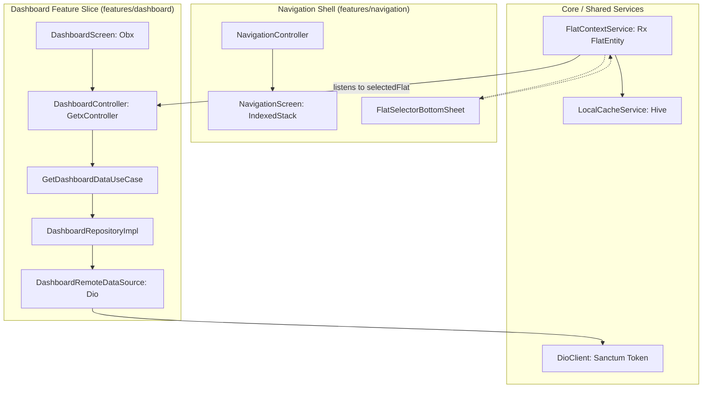

# Resident Dashboard Hub & Multi-Flat Navigation Implementation Plan (Phase 1)

> **For agentic workers:** REQUIRED SUB-SKILL: Use superpowers:subagent-driven-development to implement this plan task-by-task. Steps use checkbox (`- [ ]`) syntax for tracking.

**Goal:** Implement Phase 1 of the Resident Mobile Application in `building_utility_management_system`: a persistent Material 3 4-tab root navigation shell (`IndexedStack`), a global multi-flat switcher context (`FlatContextService`), a dynamic live ledger resident dashboard (`total_due`, `advance_held`, `current_month_charges`, `arrears`, latest bill card, notice previews, recent activity), and alignment with the backend Laravel Sanctum API.

**Architecture:** The application follows strict Clean Architecture with GetX MVVM. A permanent `FlatContextService` (`GetxService`) manages active flat state and persistence. A persistent `NavigationScreen` houses the bottom navigation bar and active flat picker chip. The `features/dashboard` vertical slice encapsulates pure Dart domain entities/use cases, `@JsonSerializable` data models, a Dio remote data source, and reactive GetX presentation widgets driven by sealed `ViewState`.

**Architecture Diagram:**



**Tech Stack:** Flutter 3.24+, Dart 3.5+, GetX 4.6+, Dio 5.4+, fpdart 1.1+, equatable 2.0+, Hive Flutter 1.1+, Flutter ScreenUtil 5.9+, json_serializable 6.8+, flutter_localizations.

## Global Constraints

- **Pure Dart Domain Layer:** Entities, use cases, and repository interfaces must contain zero dependencies on Flutter, GetX, Dio, or JSON serialization packages.
- **Dynamic Ledger Balances:** Ledger balances (`total_due`, `advance_held`, `current_month_charges`, `arrears`) must never be statically cached; always fetched dynamically via `/api/v1/resident/dashboard?flat_id={id}`.
- **Code Generation:** All DTOs must use `@JsonSerializable()` and have generated `*.g.dart` files via `build_runner`.
- **Localization Parity:** Every string must be translated into both English (`app_en.arb`) and Bangla (`app_bn.arb`).
- **Quality Gates:** Must pass `flutter gen-l10n`, `flutter analyze --fatal-infos` with 0 issues, and `flutter test` with 100% green tests.

---

### Task 1: Core API Endpoints, Localization & Shared Flat Model

**Files:**
- Modify: `lib/core/constants/api_endpoints.dart`
- Modify: `lib/core/localization/l10n/app_en.arb`
- Modify: `lib/core/localization/l10n/app_bn.arb`
- Create: `lib/shared/domain/entities/flat_entity.dart`
- Create: `lib/shared/data/models/flat_model.dart`
- Test: `test/shared/data/models/flat_model_test.dart`

**Interfaces:**
- Consumes: JSON flat payloads from backend `DashboardController::flats`.
- Produces: `FlatEntity(id: int, number: String, floor: String, buildingId: int, buildingName: String)`, `FlatModel`.

- [ ] **Step 1: Write the failing test for `FlatModel` and `FlatEntity`**

```dart
// test/shared/data/models/flat_model_test.dart
import 'package:building_utility_management_system/shared/data/models/flat_model.dart';
import 'package:building_utility_management_system/shared/domain/entities/flat_entity.dart';
import 'package:flutter_test/flutter_test.dart';

void main() {
  const jsonMap = {
    'id': 1,
    'number': 'A-101',
    'floor': '1st Floor',
    'building_id': 10,
    'building_name': 'Lake View Tower',
  };

  const model = FlatModel(
    id: 1,
    number: 'A-101',
    floor: '1st Floor',
    buildingId: 10,
    buildingName: 'Lake View Tower',
  );

  test('FlatModel fromJson parses correctly', () {
    final parsed = FlatModel.fromJson(jsonMap);
    expect(parsed, equals(model));
  });

  test('FlatModel toJson serializes correctly', () {
    final serialized = model.toJson();
    expect(serialized['id'], 1);
    expect(serialized['number'], 'A-101');
    expect(serialized['building_id'], 10);
  });

  test('FlatModel toEntity maps to FlatEntity', () {
    final entity = model.toEntity();
    expect(entity, isA<FlatEntity>());
    expect(entity.id, 1);
    expect(entity.number, 'A-101');
    expect(entity.buildingName, 'Lake View Tower');
  });
}
```

- [ ] **Step 2: Run test to verify it fails**

Run: `flutter test test/shared/data/models/flat_model_test.dart`  
Expected: Compilation failure because `flat_model.dart` and `flat_entity.dart` do not exist.

- [ ] **Step 3: Implement `FlatEntity`, `FlatModel`, `ApiEndpoints`, and Localization**

Create `lib/shared/domain/entities/flat_entity.dart`:
```dart
import 'package:equatable/equatable.dart';

class FlatEntity extends Equatable {
  final int id;
  final String number;
  final String floor;
  final int buildingId;
  final String buildingName;

  const FlatEntity({
    required this.id,
    required this.number,
    required this.floor,
    required this.buildingId,
    required this.buildingName,
  });

  String get displayName => '$number • $buildingName';

  @override
  List<Object?> get props => [id, number, floor, buildingId, buildingName];
}
```

Create `lib/shared/data/models/flat_model.dart`:
```dart
import 'package:equatable/equatable.dart';
import 'package:json_annotation/json_annotation.dart';
import '../../domain/entities/flat_entity.dart';

part 'flat_model.g.dart';

@JsonSerializable()
class FlatModel extends Equatable {
  final int id;
  final String number;
  final String floor;
  @JsonKey(name: 'building_id')
  final int buildingId;
  @JsonKey(name: 'building_name')
  final String buildingName;

  const FlatModel({
    required this.id,
    required this.number,
    required this.floor,
    required this.buildingId,
    required this.buildingName,
  });

  factory FlatModel.fromJson(Map<String, dynamic> json) => _$FlatModelFromJson(json);

  Map<String, dynamic> toJson() => _$FlatModelToJson(this);

  FlatEntity toEntity() => FlatEntity(
        id: id,
        number: number,
        floor: floor,
        buildingId: buildingId,
        buildingName: buildingName,
      );

  @override
  List<Object?> get props => [id, number, floor, buildingId, buildingName];
}
```

Update `lib/core/constants/api_endpoints.dart`:
```dart
abstract final class ApiEndpoints {
  static const login = '/auth/login';
  static const me = '/auth/me';
  static const logout = '/auth/logout';
  static const fcmToken = '/auth/fcm-token';
  static const refreshToken = '/auth/refresh';
  static const userProfile = '/users/profile';

  // Resident Portal
  static const residentFlats = '/resident/flats';
  static const residentDashboard = '/resident/dashboard';
  static const residentBills = '/resident/bills';
  static const residentSubmissions = '/resident/payment-submissions';
  static const residentPayments = '/resident/payments';
  static const residentMaintenance = '/resident/maintenance-requests';
  static const residentNotices = '/resident/notices';
}
```

Update `lib/core/localization/l10n/app_en.arb`:
```json
{
  "@@locale": "en",
  "appName": "Building Utility Management",
  "loginTitle": "Sign In",
  "loginButton": "Login",
  "emailLabel": "Email or Phone",
  "passwordLabel": "Password",
  "emailValidation": "Please enter your email or phone",
  "passwordValidation": "Password must be at least 6 characters",
  "homeTitle": "Dashboard",
  "navHome": "Home",
  "navBills": "Bills",
  "navPayments": "Payments",
  "navMaintenance": "Maintenance",
  "totalDue": "Total Outstanding Due",
  "advanceHeld": "Advance Held",
  "currentMonthCharges": "Current Month",
  "arrears": "Arrears",
  "payNow": "Submit Payment",
  "allClear": "All Cleared!",
  "noDues": "No pending utility dues",
  "latestBill": "Latest Bill",
  "viewBill": "View Details",
  "dueDate": "Due Date",
  "buildingNotices": "Building Notices",
  "noNotices": "No active announcements",
  "recentActivity": "Recent Activity",
  "quickActions": "Quick Actions",
  "selectFlat": "Select Active Flat",
  "switchFlat": "Switch Flat",
  "noFlatsAssigned": "No flat assigned to your account. Please contact building management.",
  "retry": "Retry"
}
```

Update `lib/core/localization/l10n/app_bn.arb`:
```json
{
  "@@locale": "bn",
  "appName": "বিল্ডিং ইউটিলিটি ম্যানেজমেন্ট",
  "loginTitle": "লগইন করুন",
  "loginButton": "লগইন",
  "emailLabel": "ইমেল বা ফোন নম্বর",
  "passwordLabel": "পাসওয়ার্ড",
  "emailValidation": "আপনার ইমেল বা ফোন নম্বর লিখুন",
  "passwordValidation": "পাসওয়ার্ড কমপক্ষে ৬ অক্ষরের হতে হবে",
  "homeTitle": "ড্যাশবোর্ড",
  "navHome": "হোম",
  "navBills": "বিল সমূহ",
  "navPayments": "পেমেন্ট",
  "navMaintenance": "মেরামত",
  "totalDue": "মোট বকেয়া",
  "advanceHeld": "অগ্রিম জমা",
  "currentMonthCharges": "চলতি মাস",
  "arrears": "পূর্বের বকেয়া",
  "payNow": "পেমেন্ট জমা দিন",
  "allClear": "পরিশোধিত!",
  "noDues": "কোনো বকেয়া নেই",
  "latestBill": "সাম্প্রতিক বিল",
  "viewBill": "বিস্তারিত দেখুন",
  "dueDate": "পরিশোধের শেষ তারিখ",
  "buildingNotices": "ভবনের নোটিশ",
  "noNotices": "কোনো নোটিশ নেই",
  "recentActivity": "সাম্প্রতিক কার্যক্রম",
  "quickActions": "কুইক অ্যাকশন",
  "selectFlat": "সক্রিয় ফ্ল্যাট নির্বাচন করুন",
  "switchFlat": "ফ্ল্যাট পরিবর্তন",
  "noFlatsAssigned": "আপনার অ্যাকাউন্টে কোনো ফ্ল্যাট সংযুক্ত নেই। ভবনের ম্যানেজমেন্টের সাথে যোগাযোগ করুন।",
  "retry": "পুনরায় চেষ্টা করুন"
}
```

Run generators:
```bash
flutter gen-l10n
dart run build_runner build --delete-conflicting-outputs
```

- [ ] **Step 4: Run test to verify it passes**

Run: `flutter test test/shared/data/models/flat_model_test.dart`  
Expected: PASS.

- [ ] **Step 5: Commit**

```bash
git add lib/core/constants/api_endpoints.dart lib/core/localization/l10n/ lib/shared/ test/shared/
git commit -m "feat(shared): add FlatEntity, FlatModel, api endpoints, and localization keys"
```

---

### Task 2: Backend Sanctum Auth Alignment & FlatContextService

**Files:**
- Modify: `lib/features/auth/data/models/user_model.dart`
- Modify: `lib/features/auth/data/models/auth_response_model.dart`
- Modify: `lib/features/auth/data/datasources/auth_remote_data_source.dart`
- Modify: `lib/features/auth/data/repositories/auth_repository_impl.dart`
- Create: `lib/shared/services/flat_context_service.dart`
- Modify: `lib/app/bootstrap.dart`
- Modify: `lib/features/auth/presentation/controllers/auth_controller.dart`
- Test: `test/shared/services/flat_context_service_test.dart`
- Modify: `test/features/auth/data/models/auth_response_model_test.dart`
- Modify: `test/features/auth/data/datasources/auth_remote_data_source_test.dart`

**Interfaces:**
- Consumes: Sanctum JSON response `{ success: true, data: { token: '...', user: {...}, flats: [...] } }`.
- Produces: `FlatContextService.selectedFlat`, `FlatContextService.availableFlats`, `FlatContextService.selectFlat(FlatEntity)`.

- [ ] **Step 1: Write the failing test for `FlatContextService`**

```dart
// test/shared/services/flat_context_service_test.dart
import 'package:building_utility_management_system/core/storage/local_cache_service.dart';
import 'package:building_utility_management_system/shared/domain/entities/flat_entity.dart';
import 'package:building_utility_management_system/shared/services/flat_context_service.dart';
import 'package:flutter_test/flutter_test.dart';
import 'package:mocktail/mocktail.dart';

class MockLocalCacheService extends Mock implements LocalCacheService {}

void main() {
  late MockLocalCacheService mockCache;
  late FlatContextService service;

  const flat1 = FlatEntity(id: 1, number: 'A-101', floor: '1st', buildingId: 10, buildingName: 'Tower A');
  const flat2 = FlatEntity(id: 2, number: 'B-202', floor: '2nd', buildingId: 10, buildingName: 'Tower A');

  setUp(() {
    mockCache = MockLocalCacheService();
    when(() => mockCache.getInt(any())).thenReturn(null);
    when(() => mockCache.putInt(any(), any())).thenAnswer((_) async {});
    service = FlatContextService(cacheService: mockCache);
  });

  test('initialize with list selects first flat if no cache exists', () {
    service.initializeFlats([flat1, flat2]);

    expect(service.availableFlats.length, 2);
    expect(service.selectedFlat.value, equals(flat1));
    verify(() => mockCache.putInt('active_flat_id', 1)).called(1);
  });

  test('initialize restores cached flat if present in list', () {
    when(() => mockCache.getInt('active_flat_id')).thenReturn(2);
    service.initializeFlats([flat1, flat2]);

    expect(service.selectedFlat.value, equals(flat2));
  });

  test('selectFlat updates selectedFlat and writes to cache', () {
    service.initializeFlats([flat1, flat2]);
    service.selectFlat(flat2);

    expect(service.selectedFlat.value, equals(flat2));
    verify(() => mockCache.putInt('active_flat_id', 2)).called(1);
  });
}
```

- [ ] **Step 2: Run test to verify it fails**

Run: `flutter test test/shared/services/flat_context_service_test.dart`  
Expected: FAIL (`FlatContextService` not found).

- [ ] **Step 3: Implement `FlatContextService` and align Auth slice with Sanctum response**

Create `lib/shared/services/flat_context_service.dart`:
```dart
import 'package:get/get.dart';
import '../../core/storage/local_cache_service.dart';
import '../domain/entities/flat_entity.dart';

class FlatContextService extends GetxService {
  final LocalCacheService _cacheService;
  static const String _activeFlatKey = 'active_flat_id';

  final Rx<FlatEntity?> selectedFlat = Rx<FlatEntity?>(null);
  final RxList<FlatEntity> availableFlats = <FlatEntity>[].obs;

  FlatContextService({required LocalCacheService cacheService})
      : _cacheService = cacheService;

  void initializeFlats(List<FlatEntity> flats) {
    availableFlats.assignAll(flats);
    if (flats.isEmpty) {
      selectedFlat.value = null;
      return;
    }

    final cachedId = _cacheService.getInt(_activeFlatKey);
    final matched = flats.firstWhereOrNull((f) => f.id == cachedId);

    if (matched != null) {
      selectedFlat.value = matched;
    } else {
      selectFlat(flats.first);
    }
  }

  void selectFlat(FlatEntity flat) {
    selectedFlat.value = flat;
    _cacheService.putInt(_activeFlatKey, flat.id);
  }

  void clear() {
    selectedFlat.value = null;
    availableFlats.clear();
  }
}
```

Update `lib/features/auth/data/models/auth_response_model.dart`:
```dart
import 'package:equatable/equatable.dart';
import 'package:json_annotation/json_annotation.dart';
import '../../../../shared/data/models/flat_model.dart';
import 'user_model.dart';

part 'auth_response_model.g.dart';

@JsonSerializable(explicitToJson: true)
class AuthResponseModel extends Equatable {
  final String token;
  final UserModel user;
  final List<FlatModel> flats;

  const AuthResponseModel({
    required this.token,
    required this.user,
    this.flats = const [],
  });

  factory AuthResponseModel.fromJson(Map<String, dynamic> json) =>
      _$AuthResponseModelFromJson(json);

  Map<String, dynamic> toJson() => _$AuthResponseModelToJson(this);

  @override
  List<Object?> get props => [token, user, flats];
}
```

Update `lib/features/auth/data/datasources/auth_remote_data_source.dart`:
```dart
import 'package:dio/dio.dart';
import '../../../../core/constants/api_endpoints.dart';
import '../../../../core/error/exceptions.dart';
import '../models/auth_response_model.dart';

abstract class AuthRemoteDataSource {
  Future<AuthResponseModel> login({required String email, required String password});
}

class AuthRemoteDataSourceImpl implements AuthRemoteDataSource {
  final Dio dio;
  const AuthRemoteDataSourceImpl({required this.dio});

  @override
  Future<AuthResponseModel> login({required String email, required String password}) async {
    final response = await dio.post<Map<String, dynamic>>(
      ApiEndpoints.login,
      data: <String, dynamic>{'login': email, 'password': password},
    );
    final body = response.data;
    if (body == null) {
      throw const ServerException('Received empty response from server');
    }
    final data = body['data'];
    if (data is Map<String, dynamic>) {
      return AuthResponseModel.fromJson(data);
    }
    return AuthResponseModel.fromJson(body);
  }
}
```

Update `lib/app/bootstrap.dart`:
Register `FlatContextService` in `InitialBinding`:
```dart
    if (!Get.isRegistered<FlatContextService>()) {
      Get.put<FlatContextService>(
        FlatContextService(cacheService: Get.find<LocalCacheService>()),
        permanent: true,
      );
    }
```

Run code generation:
```bash
dart run build_runner build --delete-conflicting-outputs
```

- [ ] **Step 4: Run tests to verify they pass**

Run: `flutter test test/shared/services/flat_context_service_test.dart` and `flutter test test/features/auth/`  
Expected: PASS.

- [ ] **Step 5: Commit**

```bash
git add lib/features/auth/ lib/shared/services/ lib/app/bootstrap.dart test/
git commit -m "feat(auth): align Sanctum login response with token, flats, and FlatContextService"
```

---

### Task 3: Dashboard Domain Entities, Repository Contract & Use Cases

**Files:**
- Create: `lib/features/dashboard/domain/entities/resident_balances_entity.dart`
- Create: `lib/features/dashboard/domain/entities/latest_bill_entity.dart`
- Create: `lib/features/dashboard/domain/entities/notice_snippet_entity.dart`
- Create: `lib/features/dashboard/domain/entities/recent_activity_entity.dart`
- Create: `lib/features/dashboard/domain/entities/dashboard_data_entity.dart`
- Create: `lib/features/dashboard/domain/repositories/dashboard_repository.dart`
- Create: `lib/features/dashboard/domain/usecases/get_resident_flats_usecase.dart`
- Create: `lib/features/dashboard/domain/usecases/get_dashboard_data_usecase.dart`
- Test: `test/features/dashboard/domain/usecases/get_dashboard_data_usecase_test.dart`

**Interfaces:**
- Consumes: `flatId: int` from controller.
- Produces: `Either<Failure, DashboardDataEntity>` via `GetDashboardDataUseCase`.

- [ ] **Step 1: Write the failing test for `GetDashboardDataUseCase`**

```dart
// test/features/dashboard/domain/usecases/get_dashboard_data_usecase_test.dart
import 'package:building_utility_management_system/core/error/failures.dart';
import 'package:building_utility_management_system/features/dashboard/domain/entities/dashboard_data_entity.dart';
import 'package:building_utility_management_system/features/dashboard/domain/entities/latest_bill_entity.dart';
import 'package:building_utility_management_system/features/dashboard/domain/entities/resident_balances_entity.dart';
import 'package:building_utility_management_system/features/dashboard/domain/repositories/dashboard_repository.dart';
import 'package:building_utility_management_system/features/dashboard/domain/usecases/get_dashboard_data_usecase.dart';
import 'package:building_utility_management_system/shared/domain/entities/flat_entity.dart';
import 'package:flutter_test/flutter_test.dart';
import 'package:fpdart/fpdart.dart';
import 'package:mocktail/mocktail.dart';

class MockDashboardRepository extends Mock implements DashboardRepository {}

void main() {
  late MockDashboardRepository mockRepository;
  late GetDashboardDataUseCase usecase;

  const sampleData = DashboardDataEntity(
    flat: FlatEntity(id: 1, number: 'A-101', floor: '1st', buildingId: 10, buildingName: 'Tower'),
    balances: ResidentBalancesEntity(
      totalDue: '5000.00',
      advanceHeld: '0.00',
      currentMonthCharges: '5000.00',
      arrears: '0.00',
    ),
    latestBill: LatestBillEntity(
      id: 10,
      billNo: 'SCB-2026-09-01',
      billingMonth: '2026-09',
      totalAmount: '5000.00',
      dueDate: '2026-09-15',
      status: 'unpaid',
    ),
    activeNotices: [],
    recentActivity: [],
  );

  setUp(() {
    mockRepository = MockDashboardRepository();
    usecase = GetDashboardDataUseCase(mockRepository);
  });

  test('should return Right(DashboardDataEntity) when repository succeeds', () async {
    when(() => mockRepository.getDashboardData(flatId: 1))
        .thenAnswer((_) async => const Right(sampleData));

    final result = await usecase(flatId: 1);

    expect(result, const Right(sampleData));
    verify(() => mockRepository.getDashboardData(flatId: 1)).called(1);
  });

  test('should return Left(ServerFailure) when repository fails', () async {
    when(() => mockRepository.getDashboardData(flatId: 1))
        .thenAnswer((_) async => const Left(ServerFailure('Server error')));

    final result = await usecase(flatId: 1);

    expect(result, const Left(ServerFailure('Server error')));
  });
}
```

- [ ] **Step 2: Run test to verify it fails**

Run: `flutter test test/features/dashboard/domain/usecases/get_dashboard_data_usecase_test.dart`  
Expected: FAIL.

- [ ] **Step 3: Implement Dashboard Domain entities and usecases**

Create `lib/features/dashboard/domain/entities/resident_balances_entity.dart`, `latest_bill_entity.dart`, `notice_snippet_entity.dart`, `recent_activity_entity.dart`, `dashboard_data_entity.dart`, `dashboard_repository.dart`, `get_resident_flats_usecase.dart`, and `get_dashboard_data_usecase.dart`.

- [ ] **Step 4: Run test to verify it passes**

Run: `flutter test test/features/dashboard/domain/usecases/get_dashboard_data_usecase_test.dart`  
Expected: PASS.

- [ ] **Step 5: Commit**

```bash
git add lib/features/dashboard/domain/ test/features/dashboard/domain/
git commit -m "feat(dashboard): add domain entities, repository contract, and use cases"
```

---

### Task 4: Dashboard Data Models, Remote Data Source & Repository Implementation

**Files:**
- Create: `lib/features/dashboard/data/models/resident_balances_model.dart`
- Create: `lib/features/dashboard/data/models/latest_bill_model.dart`
- Create: `lib/features/dashboard/data/models/notice_snippet_model.dart`
- Create: `lib/features/dashboard/data/models/dashboard_data_model.dart`
- Create: `lib/features/dashboard/data/datasources/dashboard_remote_data_source.dart`
- Create: `lib/features/dashboard/data/repositories/dashboard_repository_impl.dart`
- Test: `test/features/dashboard/data/models/dashboard_data_model_test.dart`
- Test: `test/features/dashboard/data/datasources/dashboard_remote_data_source_test.dart`
- Test: `test/features/dashboard/data/repositories/dashboard_repository_impl_test.dart`

**Interfaces:**
- Consumes: `GET /api/v1/resident/dashboard?flat_id={id}` and `GET /api/v1/resident/flats`.
- Produces: `DashboardRemoteDataSourceImpl`, `DashboardRepositoryImpl`.

- [ ] **Step 1: Write failing data source and model tests**

```dart
// test/features/dashboard/data/models/dashboard_data_model_test.dart
import 'package:building_utility_management_system/features/dashboard/data/models/dashboard_data_model.dart';
import 'package:flutter_test/flutter_test.dart';

void main() {
  const jsonMap = {
    'flat': {
      'id': 1,
      'number': 'A-101',
      'floor': '1st Floor',
      'building_id': 10,
      'building_name': 'Lake View Tower',
    },
    'balances': {
      'total_due': '5000.00',
      'advance_held': '0.00',
      'current_month_charges': '4500.00',
      'arrears': '500.00',
    },
    'latest_bill': {
      'id': 101,
      'bill_no': 'SCB-2026-09-014',
      'billing_month': '2026-09',
      'total_amount': '4500.00',
      'due_date': '2026-09-15',
      'status': 'unpaid',
    },
    'active_notices': [
      {
        'id': 5,
        'title': 'Elevator Maintenance',
        'content': 'Elevator service on Saturday.',
        'type': 'maintenance',
        'is_pinned': true,
        'published_at': '2026-09-10T10:00:00.000Z',
      }
    ],
    'recent_payments': [
      {
        'id': 12,
        'receipt_no': 'REC-1002',
        'amount': '4500.00',
        'method': 'bKash',
        'received_on': '2026-08-10',
      }
    ],
    'recent_submissions': [],
    'my_tickets': [],
  };

  test('DashboardDataModel parses backend JSON envelope successfully', () {
    final model = DashboardDataModel.fromJson(jsonMap);
    expect(model.flat.number, 'A-101');
    expect(model.balances.totalDue, '5000.00');
    expect(model.latestBill?.billNo, 'SCB-2026-09-014');
    expect(model.activeNotices.length, 1);
    expect(model.activeNotices.first.isPinned, isTrue);
  });
}
```

- [ ] **Step 2: Run test to verify it fails**

Run: `flutter test test/features/dashboard/data/models/dashboard_data_model_test.dart`  
Expected: FAIL.

- [ ] **Step 3: Implement data models, remote data source, and repository implementation**

Implement `@JsonSerializable` models, run `dart run build_runner build --delete-conflicting-outputs`, implement `DashboardRemoteDataSourceImpl` calling Dio, and `DashboardRepositoryImpl`.

- [ ] **Step 4: Run tests to verify they pass**

Run: `flutter test test/features/dashboard/data/`  
Expected: PASS.

- [ ] **Step 5: Commit**

```bash
git add lib/features/dashboard/data/ test/features/dashboard/data/
git commit -m "feat(dashboard): implement data models, remote data source, and repository"
```

---

### Task 5: Root Navigation Shell & Multi-Flat Switcher Bottom Sheet

**Files:**
- Create: `lib/features/navigation/presentation/controllers/navigation_controller.dart`
- Create: `lib/features/navigation/presentation/bindings/navigation_binding.dart`
- Create: `lib/features/navigation/presentation/widgets/flat_selector_bottom_sheet.dart`
- Create: `lib/features/navigation/presentation/screens/navigation_screen.dart`
- Modify: `lib/core/routing/app_pages.dart`
- Test: `test/features/navigation/presentation/controllers/navigation_controller_test.dart`
- Test: `test/features/navigation/presentation/screens/navigation_screen_test.dart`

**Interfaces:**
- Consumes: `FlatContextService.selectedFlat`, `FlatContextService.availableFlats`.
- Produces: `NavigationScreen`, `NavigationBinding`, routes registered at `AppRoutes.home`.

- [ ] **Step 1: Write failing controller test for `NavigationController`**

```dart
// test/features/navigation/presentation/controllers/navigation_controller_test.dart
import 'package:building_utility_management_system/features/navigation/presentation/controllers/navigation_controller.dart';
import 'package:flutter_test/flutter_test.dart';

void main() {
  late NavigationController controller;

  setUp(() {
    controller = NavigationController();
  });

  test('initial tab index should be 0', () {
    expect(controller.currentIndex.value, 0);
  });

  test('changeTab updates currentIndex', () {
    controller.changeTab(2);
    expect(controller.currentIndex.value, 2);
  });
}
```

- [ ] **Step 2: Run test to verify it fails**

Run: `flutter test test/features/navigation/presentation/controllers/navigation_controller_test.dart`  
Expected: FAIL.

- [ ] **Step 3: Implement `NavigationController`, `FlatSelectorBottomSheet`, `NavigationScreen`, and `NavigationBinding`**

Implement the navigation controller, bottom sheet modal, screen with Material 3 NavigationBar and IndexedStack, and configure `AppPages.routes` at `AppRoutes.home`.

- [ ] **Step 4: Run tests to verify they pass**

Run: `flutter test test/features/navigation/`  
Expected: PASS.

- [ ] **Step 5: Commit**

```bash
git add lib/features/navigation/ lib/core/routing/app_pages.dart test/features/navigation/
git commit -m "feat(navigation): add root navigation shell with tabs and flat selector bottom sheet"
```

---

### Task 6: Dashboard Presentation Layer (Widgets, Controller & Screen)

**Files:**
- Create: `lib/features/dashboard/presentation/controllers/dashboard_controller.dart`
- Create: `lib/features/dashboard/presentation/bindings/dashboard_binding.dart`
- Create: `lib/features/dashboard/presentation/widgets/balance_hero_card.dart`
- Create: `lib/features/dashboard/presentation/widgets/latest_bill_card.dart`
- Create: `lib/features/dashboard/presentation/widgets/notices_banner_widget.dart`
- Create: `lib/features/dashboard/presentation/widgets/quick_actions_row.dart`
- Create: `lib/features/dashboard/presentation/widgets/recent_activity_list.dart`
- Create: `lib/features/dashboard/presentation/screens/dashboard_screen.dart`
- Test: `test/features/dashboard/presentation/controllers/dashboard_controller_test.dart`
- Test: `test/features/dashboard/presentation/screens/dashboard_screen_test.dart`

**Interfaces:**
- Consumes: `GetDashboardDataUseCase`, `FlatContextService.selectedFlat`.
- Produces: `DashboardController`, `DashboardScreen`, `DashboardBinding`.

- [ ] **Step 1: Write failing controller test for `DashboardController`**

```dart
// test/features/dashboard/presentation/controllers/dashboard_controller_test.dart
import 'package:building_utility_management_system/core/base/view_state.dart';
import 'package:building_utility_management_system/core/error/failures.dart';
import 'package:building_utility_management_system/features/dashboard/domain/entities/dashboard_data_entity.dart';
import 'package:building_utility_management_system/features/dashboard/domain/entities/resident_balances_entity.dart';
import 'package:building_utility_management_system/features/dashboard/domain/usecases/get_dashboard_data_usecase.dart';
import 'package:building_utility_management_system/features/dashboard/presentation/controllers/dashboard_controller.dart';
import 'package:building_utility_management_system/shared/domain/entities/flat_entity.dart';
import 'package:building_utility_management_system/shared/services/flat_context_service.dart';
import 'package:flutter_test/flutter_test.dart';
import 'package:fpdart/fpdart.dart';
import 'package:mocktail/mocktail.dart';

class MockGetDashboardDataUseCase extends Mock implements GetDashboardDataUseCase {}
class MockFlatContextService extends Mock implements FlatContextService {}

void main() {
  late MockGetDashboardDataUseCase mockUseCase;
  late MockFlatContextService mockFlatService;
  late DashboardController controller;

  const sampleData = DashboardDataEntity(
    flat: FlatEntity(id: 1, number: 'A-101', floor: '1st', buildingId: 10, buildingName: 'Tower'),
    balances: ResidentBalancesEntity(
      totalDue: '5000.00',
      advanceHeld: '0.00',
      currentMonthCharges: '5000.00',
      arrears: '0.00',
    ),
    activeNotices: [],
    recentActivity: [],
  );

  setUp(() {
    mockUseCase = MockGetDashboardDataUseCase();
    mockFlatService = MockFlatContextService();
    when(() => mockFlatService.selectedFlat).thenReturn(null.obs);
  });

  test('loadDashboard sets SuccessState on success', () async {
    when(() => mockUseCase(flatId: 1)).thenAnswer((_) async => const Right(sampleData));

    controller = DashboardController(
      getDashboardDataUseCase: mockUseCase,
      flatService: mockFlatService,
    );

    await controller.loadDashboard(flatId: 1);

    expect(controller.state.value, isA<SuccessState<DashboardDataEntity>>());
  });

  test('loadDashboard sets ErrorState on failure', () async {
    when(() => mockUseCase(flatId: 1)).thenAnswer((_) async => const Left(ServerFailure('API error')));

    controller = DashboardController(
      getDashboardDataUseCase: mockUseCase,
      flatService: mockFlatService,
    );

    await controller.loadDashboard(flatId: 1);

    expect(controller.state.value, isA<ErrorState>());
  });
}
```

- [ ] **Step 2: Run test to verify it fails**

Run: `flutter test test/features/dashboard/presentation/controllers/dashboard_controller_test.dart`  
Expected: FAIL.

- [ ] **Step 3: Implement `DashboardController`, presentation widgets, and `DashboardScreen`**

Implement `DashboardController`, `BalanceHeroCard`, `LatestBillCard`, `NoticesBannerWidget`, `QuickActionsRow`, `RecentActivityList`, and `DashboardScreen`.

- [ ] **Step 4: Run tests to verify they pass**

Run: `flutter test test/features/dashboard/presentation/`  
Expected: PASS.

- [ ] **Step 5: Commit**

```bash
git add lib/features/dashboard/presentation/ test/features/dashboard/presentation/
git commit -m "feat(dashboard): implement reactive dashboard screen, hero balance card, and controller"
```

---

### Task 7: End-to-End Routing & Quality Gate Audit

**Files:**
- Modify: `test/app/app_test.dart`
- Run: Complete verification suite

- [ ] **Step 1: Run Localization Generator**

```bash
flutter gen-l10n
```
Expected: 0 errors.

- [ ] **Step 2: Run Code Generator**

```bash
dart run build_runner build --delete-conflicting-outputs
```
Expected: Clean build.

- [ ] **Step 3: Run Static Analyzer with fatal infos**

```bash
flutter analyze --fatal-infos
```
Expected: `No issues found!` (0 errors, 0 warnings, 0 infos).

- [ ] **Step 4: Run complete test suite**

```bash
flutter test
```
Expected: 100% tests pass.

- [ ] **Step 5: Commit all remaining changes**

```bash
git add -A
git commit -m "chore: complete verification gate audit for resident dashboard and navigation"
```
