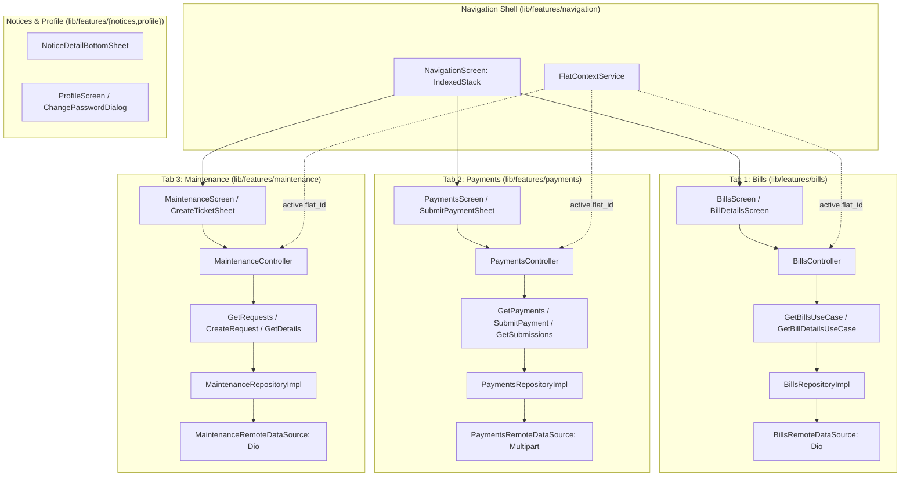

# Full Resident Web-Parity Implementation Plan (Phase 2)

> **For agentic workers:** REQUIRED SUB-SKILL: Use superpowers:subagent-driven-development to implement this plan task-by-task. Steps use checkbox (`- [ ]`) syntax for tracking.

**Goal:** Implement Phase 2 of the Resident Mobile Application in `building_utility_management_system` to achieve 100% functional parity with the web resident portal: replace placeholder tabs with live Maintenance ticket CRUD (Tab 3), Payments and Slip Submissions with PDF receipt launcher (Tab 2), Bills with itemized charge breakdown and PDF printer (Tab 1), interactive Notice details modal, and a Profile/Account screen with password change and language toggle.

**Architecture:** Strictly follows Clean Architecture with GetX MVVM. The domain layer encapsulates pure Dart entities, enums, and use cases returning `Either<Failure, T>`. The data layer implements `@JsonSerializable` DTOs, Dio remote datasources (supporting JSON and multipart image uploads), and repository implementations. The presentation layer employs reactive GetX controllers observing sealed `ViewState<T>`, responsive UI widgets via `flutter_screenutil`, and reactive integration with `FlatContextService`.

**Architecture Diagram:**



**Tech Stack:** Flutter 3.24+, Dart 3.5+, GetX 4.6+, Dio 5.4+, fpdart 1.1+, image_picker 1.1+, url_launcher 6.3+, flutter_screenutil 5.9+, json_serializable 6.8+, flutter_localizations.

## Global Constraints

- **Pure Dart Domain Layer:** All entities, enums, and use cases in `domain/` must contain zero dependencies on Flutter, GetX, Dio, or UI packages.
- **Dynamic Ledger Integrity:** Ledger balances and bills must always be fetched dynamically for the active `flat_id`; no hardcoded or mock financial data.
- **Strict Code Generation:** All DTO models must have generated `*.g.dart` files via `build_runner`.
- **Complete Localization:** Every string key must exist with identical names and parameters in both `app_en.arb` and `app_bn.arb`.
- **Quality Gates:** Must pass `flutter gen-l10n`, `flutter analyze --fatal-infos` (0 warnings, 0 infos, 0 errors), and `flutter test` with 100% green tests.

---

### Task 1: Core Dependencies, Endpoints & Localization Strings

**Files:**
- Modify: `pubspec.yaml`
- Modify: `lib/core/constants/api_endpoints.dart`
- Modify: `lib/core/localization/l10n/app_en.arb`
- Modify: `lib/core/localization/l10n/app_bn.arb`
- Test: `test/core/constants/api_endpoints_test.dart`

**Interfaces:**
- Produces: API constants for bills, payments, submissions, maintenance, notices, profile.
- Produces: Localization string keys across English and Bangla.

- [ ] **Step 1: Write failing test for new API endpoints**

```dart
// test/core/constants/api_endpoints_test.dart
import 'package:flutter_test/flutter_test.dart';
import 'package:building_utility_management_system/core/constants/api_endpoints.dart';

void main() {
  group('ApiEndpoints parity check', () {
    test('contains all resident web parity routes', () {
      expect(ApiEndpoints.residentBills, '/resident/bills');
      expect(ApiEndpoints.residentPaymentSubmissions, '/resident/payment-submissions');
      expect(ApiEndpoints.residentPayments, '/resident/payments');
      expect(ApiEndpoints.residentMaintenance, '/resident/maintenance-requests');
      expect(ApiEndpoints.residentNotices, '/resident/notices');
      expect(ApiEndpoints.changePassword, '/auth/change-password');
    });
  });
}
```

- [ ] **Step 2: Run test to verify it fails**

Run: `flutter test test/core/constants/api_endpoints_test.dart`  
Expected: FAIL (getter not found).

- [ ] **Step 3: Update dependencies, endpoints, and localization ARB files**

Add dependencies to `pubspec.yaml`:
```yaml
  image_picker: ^1.1.2
  url_launcher: ^6.3.0
```

Add endpoints to `lib/core/constants/api_endpoints.dart`:
```dart
  // Bills
  static const String residentBills = '/resident/bills';
  static String residentBillDetails(int id) => '/resident/bills/$id';

  // Payments & Submissions
  static const String residentPaymentSubmissions = '/resident/payment-submissions';
  static const String residentPayments = '/resident/payments';
  static String residentPaymentReceipt(int id) => '/resident/payments/$id/receipt';

  // Maintenance Requests
  static const String residentMaintenance = '/resident/maintenance-requests';
  static String residentMaintenanceDetails(int id) => '/resident/maintenance-requests/$id';

  // Notices
  static const String residentNotices = '/resident/notices';
  static String residentNoticeDetails(int id) => '/resident/notices/$id';

  // Auth & Profile
  static const String changePassword = '/auth/change-password';
```

Add localized strings in `app_en.arb` and `app_bn.arb` covering tickets, submissions, bills, and profile labels.

- [ ] **Step 4: Run build tools and tests**

Run:
```bash
flutter pub get
flutter gen-l10n
flutter test test/core/constants/api_endpoints_test.dart
```
Expected: PASS.

- [ ] **Step 5: Commit**

```bash
git add pubspec.yaml pubspec.lock lib/core/ test/
git commit -m "feat: add dependencies, API endpoints, and localization strings for resident web parity"
```

---

### Task 2: Maintenance Domain & Data Layers (Ticket CRUD)

**Files:**
- Create: `lib/features/maintenance/domain/entities/maintenance_request_entity.dart`
- Create: `lib/features/maintenance/domain/repositories/maintenance_repository.dart`
- Create: `lib/features/maintenance/domain/usecases/get_maintenance_requests_usecase.dart`
- Create: `lib/features/maintenance/domain/usecases/get_maintenance_details_usecase.dart`
- Create: `lib/features/maintenance/domain/usecases/create_maintenance_request_usecase.dart`
- Create: `lib/features/maintenance/data/models/maintenance_request_model.dart`
- Create: `lib/features/maintenance/data/datasources/maintenance_remote_data_source.dart`
- Create: `lib/features/maintenance/data/repositories/maintenance_repository_impl.dart`
- Test: `test/features/maintenance/data/models/maintenance_request_model_test.dart`
- Test: `test/features/maintenance/data/repositories/maintenance_repository_impl_test.dart`

**Interfaces:**
- Consumes: `DioClient`, `FlatContextService.selectedFlat.value?.id`.
- Produces: `MaintenanceRequestEntity`, `MaintenanceRepository`, `GetMaintenanceRequestsUseCase`, `CreateMaintenanceRequestUseCase`.

- [ ] **Step 1: Write model and repository tests**

```dart
// test/features/maintenance/data/models/maintenance_request_model_test.dart
import 'package:flutter_test/flutter_test.dart';
import 'package:building_utility_management_system/features/maintenance/data/models/maintenance_request_model.dart';

void main() {
  final json = {
    'id': 1,
    'title': 'Leaky pipe',
    'description': 'Water leaking under sink',
    'category': 'plumbing',
    'priority': 'high',
    'status': 'open',
    'assigned_staff': 'Rahim Khan',
    'resolution_notes': null,
    'resolved_at': null,
    'created_at': '2026-09-11T12:00:00Z',
  };

  test('fromJson parses maintenance request correctly', () {
    final model = MaintenanceRequestModel.fromJson(json);
    expect(model.id, 1);
    expect(model.title, 'Leaky pipe');
    expect(model.category, 'plumbing');
    expect(model.priority, 'high');
    expect(model.status, 'open');
  });
}
```

- [ ] **Step 2: Run test to verify it fails**

Run: `flutter test test/features/maintenance/data/models/maintenance_request_model_test.dart`  
Expected: FAIL.

- [ ] **Step 3: Implement domain entities, models, datasource, and repository**

Implement `MaintenanceRequestEntity` with enum cases matching Laravel:
- Category: `plumbing`, `electrical`, `elevator`, `cleaning`, `security`, `other`.
- Priority: `low`, `medium`, `high`, `emergency`.
- Status: `open`, `in_progress`, `resolved`, `closed`.

Implement `MaintenanceRemoteDataSource`:
- `getRequests({required int flatId, String? status, int page = 1})` -> `GET /api/v1/resident/maintenance-requests`
- `getRequestDetails(int id)` -> `GET /api/v1/resident/maintenance-requests/$id`
- `createRequest(...)` -> `POST /api/v1/resident/maintenance-requests`

Generate JSON serialization via `dart run build_runner build --delete-conflicting-outputs`.

- [ ] **Step 4: Run tests**

Run: `flutter test test/features/maintenance/`  
Expected: PASS.

- [ ] **Step 5: Commit**

```bash
git add lib/features/maintenance/ test/features/maintenance/
git commit -m "feat(maintenance): implement domain and data layers for maintenance requests"
```

---

### Task 3: Maintenance Presentation Layer (Tab 3 Screen & Create Ticket Flow)

**Files:**
- Create: `lib/features/maintenance/presentation/controllers/maintenance_controller.dart`
- Create: `lib/features/maintenance/presentation/bindings/maintenance_binding.dart`
- Create: `lib/features/maintenance/presentation/widgets/maintenance_filter_bar.dart`
- Create: `lib/features/maintenance/presentation/widgets/maintenance_card.dart`
- Create: `lib/features/maintenance/presentation/widgets/create_ticket_bottom_sheet.dart`
- Create: `lib/features/maintenance/presentation/screens/maintenance_screen.dart`
- Create: `lib/features/maintenance/presentation/screens/maintenance_details_screen.dart`
- Modify: `lib/features/navigation/presentation/screens/navigation_screen.dart`
- Test: `test/features/maintenance/presentation/controllers/maintenance_controller_test.dart`

**Interfaces:**
- Consumes: `GetMaintenanceRequestsUseCase`, `CreateMaintenanceRequestUseCase`.
- Produces: `MaintenanceScreen` integrated into Tab 3 of `NavigationScreen`.

- [ ] **Step 1: Write controller test**

```dart
// test/features/maintenance/presentation/controllers/maintenance_controller_test.dart
import 'package:flutter_test/flutter_test.dart';
import 'package:mocktail/mocktail.dart';
import 'package:fpdart/fpdart.dart';
import 'package:building_utility_management_system/core/base/view_state.dart';
import 'package:building_utility_management_system/features/maintenance/presentation/controllers/maintenance_controller.dart';
import 'package:building_utility_management_system/features/maintenance/domain/usecases/get_maintenance_requests_usecase.dart';
import 'package:building_utility_management_system/features/maintenance/domain/usecases/create_maintenance_request_usecase.dart';

class MockGetMaintenanceRequestsUseCase extends Mock implements GetMaintenanceRequestsUseCase {}
class MockCreateMaintenanceRequestUseCase extends Mock implements CreateMaintenanceRequestUseCase {}

void main() {
  late MockGetMaintenanceRequestsUseCase mockGetUC;
  late MockCreateMaintenanceRequestUseCase mockCreateUC;
  late MaintenanceController controller;

  setUp(() {
    mockGetUC = MockGetMaintenanceRequestsUseCase();
    mockCreateUC = MockCreateMaintenanceRequestUseCase();
    controller = MaintenanceController(
      getRequestsUseCase: mockGetUC,
      createRequestUseCase: mockCreateUC,
    );
  });

  test('initial state is LoadingState or SuccessState', () async {
    when(() => mockGetUC.call(any())).thenAnswer((_) async => const Right([]));
    await controller.loadRequests(flatId: 1);
    expect(controller.state.value, isA<SuccessState>());
  });
}
```

- [ ] **Step 2: Run test to verify it fails**

Run: `flutter test test/features/maintenance/presentation/controllers/maintenance_controller_test.dart`  
Expected: FAIL.

- [ ] **Step 3: Implement presentation controller, widgets, screens, and bind Tab 3**

1. Implement `MaintenanceController`:
   - Listens to active flat changes via `FlatContextService`.
   - Manages selected filter chip (`All`, `Open`, `In Progress`, `Resolved`, `Closed`).
   - Handles pull-to-refresh and ticket creation dispatch.
2. Implement `MaintenanceScreen` with `MaintenanceFilterBar`, `MaintenanceCard` list, and FAB for `CreateTicketBottomSheet`.
3. Implement `CreateTicketBottomSheet` with form validation for title, category, priority, and description.
4. Implement `MaintenanceDetailsScreen` showing timeline progress stepper.
5. In `lib/features/navigation/presentation/screens/navigation_screen.dart`, replace `_PlaceholderTab(title: context.l10n.navMaintenance)` with `const MaintenanceScreen()`.

- [ ] **Step 4: Run tests**

Run: `flutter test test/features/maintenance/presentation/`  
Expected: PASS.

- [ ] **Step 5: Commit**

```bash
git add lib/features/maintenance/presentation/ lib/features/navigation/presentation/ test/features/maintenance/presentation/
git commit -m "feat(maintenance): implement maintenance screen, ticket creation sheet, and bind Tab 3"
```

---

### Task 4: Payments & Submissions Domain & Data Layers

**Files:**
- Create: `lib/features/payments/domain/entities/payment_entity.dart`
- Create: `lib/features/payments/domain/entities/payment_submission_entity.dart`
- Create: `lib/features/payments/domain/repositories/payments_repository.dart`
- Create: `lib/features/payments/domain/usecases/get_payments_usecase.dart`
- Create: `lib/features/payments/domain/usecases/get_payment_submissions_usecase.dart`
- Create: `lib/features/payments/domain/usecases/submit_payment_usecase.dart`
- Create: `lib/features/payments/data/models/payment_model.dart`
- Create: `lib/features/payments/data/models/payment_submission_model.dart`
- Create: `lib/features/payments/data/datasources/payments_remote_data_source.dart`
- Create: `lib/features/payments/data/repositories/payments_repository_impl.dart`
- Test: `test/features/payments/data/models/payment_submission_model_test.dart`

**Interfaces:**
- Consumes: `DioClient` with multipart form data.
- Produces: `PaymentEntity`, `PaymentSubmissionEntity`, `PaymentsRepository`, usecases.

- [ ] **Step 1: Write model test**

```dart
// test/features/payments/data/models/payment_submission_model_test.dart
import 'package:flutter_test/flutter_test.dart';
import 'package:building_utility_management_system/features/payments/data/models/payment_submission_model.dart';

void main() {
  final json = {
    'id': 10,
    'amount': '3500.00',
    'payment_method': 'bkash',
    'reference_number': 'TRX9928374',
    'payment_date': '2026-09-11',
    'slip_url': 'http://api.test/storage/payment_slips/sample.jpg',
    'resident_notes': 'September maintenance',
    'status': 'pending',
    'rejection_reason': null,
    'created_at': '2026-09-11T14:30:00Z',
  };

  test('PaymentSubmissionModel parses properly from JSON', () {
    final model = PaymentSubmissionModel.fromJson(json);
    expect(model.id, 10);
    expect(model.amount, '3500.00');
    expect(model.paymentMethod, 'bkash');
    expect(model.status, 'pending');
  });
}
```

- [ ] **Step 2: Run test to verify it fails**

Run: `flutter test test/features/payments/data/models/payment_submission_model_test.dart`  
Expected: FAIL.

- [ ] **Step 3: Implement entities, models, datasource, and repository**

1. Implement `PaymentEntity` and `PaymentSubmissionEntity`.
2. Implement `PaymentModel` and `PaymentSubmissionModel` with `build_runner`.
3. Implement `PaymentsRemoteDataSource`:
   - `getSubmissions({required int flatId, String? status, int page = 1})`
   - `getPayments({required int flatId, int page = 1})`
   - `submitPayment({required int flatId, required String amount, required String method, required String referenceNumber, required String paymentDate, String? notes, String? slipFilePath})` using `FormData.fromMap` with `MultipartFile.fromFile`.
4. Implement `PaymentsRepositoryImpl`.

- [ ] **Step 4: Run tests**

Run: `flutter test test/features/payments/`  
Expected: PASS.

- [ ] **Step 5: Commit**

```bash
git add lib/features/payments/ test/features/payments/
git commit -m "feat(payments): implement domain and data layers for payments and submissions"
```

---

### Task 5: Payments Presentation Layer (Tab 2 Screen, Slips & Receipts)

**Files:**
- Create: `lib/features/payments/presentation/controllers/payments_controller.dart`
- Create: `lib/features/payments/presentation/bindings/payments_binding.dart`
- Create: `lib/features/payments/presentation/widgets/verified_payments_list.dart`
- Create: `lib/features/payments/presentation/widgets/payment_submissions_list.dart`
- Create: `lib/features/payments/presentation/widgets/submit_payment_bottom_sheet.dart`
- Create: `lib/features/payments/presentation/widgets/slip_image_picker_field.dart`
- Create: `lib/features/payments/presentation/screens/payments_screen.dart`
- Modify: `lib/features/navigation/presentation/screens/navigation_screen.dart`
- Test: `test/features/payments/presentation/controllers/payments_controller_test.dart`

**Interfaces:**
- Consumes: `GetPaymentsUseCase`, `GetPaymentSubmissionsUseCase`, `SubmitPaymentUseCase`, `url_launcher`.
- Produces: `PaymentsScreen` integrated into Tab 2 of `NavigationScreen`.

- [ ] **Step 1: Write controller test**

```dart
// test/features/payments/presentation/controllers/payments_controller_test.dart
import 'package:flutter_test/flutter_test.dart';
import 'package:mocktail/mocktail.dart';
import 'package:fpdart/fpdart.dart';
import 'package:building_utility_management_system/features/payments/presentation/controllers/payments_controller.dart';
import 'package:building_utility_management_system/features/payments/domain/usecases/get_payments_usecase.dart';
import 'package:building_utility_management_system/features/payments/domain/usecases/get_payment_submissions_usecase.dart';
import 'package:building_utility_management_system/features/payments/domain/usecases/submit_payment_usecase.dart';

class MockGetPaymentsUseCase extends Mock implements GetPaymentsUseCase {}
class MockGetSubmissionsUseCase extends Mock implements GetPaymentSubmissionsUseCase {}
class MockSubmitPaymentUseCase extends Mock implements SubmitPaymentUseCase {}

void main() {
  test('PaymentsController initializes and switches tabs', () {
    final controller = PaymentsController(
      getPaymentsUseCase: MockGetPaymentsUseCase(),
      getSubmissionsUseCase: MockGetSubmissionsUseCase(),
      submitPaymentUseCase: MockSubmitPaymentUseCase(),
    );
    expect(controller.selectedTabIndex.value, 0);
    controller.changeTab(1);
    expect(controller.selectedTabIndex.value, 1);
  });
}
```

- [ ] **Step 2: Run test to verify it fails**

Run: `flutter test test/features/payments/presentation/controllers/payments_controller_test.dart`  
Expected: FAIL.

- [ ] **Step 3: Implement controller, UI widgets, bottom sheet, and bind Tab 2**

1. Implement `PaymentsController` handling two sub-tabs: Verified Payments and My Submissions.
2. Implement `SlipImagePickerField` using `image_picker` (Camera & Gallery options) with preview thumbnail and clear button.
3. Implement `SubmitPaymentBottomSheet`:
   - Method selector (bKash, Nagad, Bank, Cash).
   - Amount field, Reference/TrxID field, DatePicker, slip picker, optional notes.
4. Implement `VerifiedPaymentsList` with "Download Receipt" action calling `url_launcher.launchUrl(Uri.parse(payment.receiptUrl))`.
5. Implement `PaymentSubmissionsList` highlighting rejection reason for rejected slips.
6. In `lib/features/navigation/presentation/screens/navigation_screen.dart`, replace `_PlaceholderTab(title: context.l10n.navPayments)` with `const PaymentsScreen()`.

- [ ] **Step 4: Run tests**

Run: `flutter test test/features/payments/presentation/`  
Expected: PASS.

- [ ] **Step 5: Commit**

```bash
git add lib/features/payments/presentation/ lib/features/navigation/presentation/ test/features/payments/presentation/
git commit -m "feat(payments): implement payments screen, submission bottom sheet, and bind Tab 2"
```

---

### Task 6: Bills Domain & Data Layers

**Files:**
- Create: `lib/features/bills/domain/entities/bill_entity.dart`
- Create: `lib/features/bills/domain/entities/bill_item_entity.dart`
- Create: `lib/features/bills/domain/repositories/bills_repository.dart`
- Create: `lib/features/bills/domain/usecases/get_bills_usecase.dart`
- Create: `lib/features/bills/domain/usecases/get_bill_details_usecase.dart`
- Create: `lib/features/bills/data/models/bill_model.dart`
- Create: `lib/features/bills/data/models/bill_item_model.dart`
- Create: `lib/features/bills/data/datasources/bills_remote_data_source.dart`
- Create: `lib/features/bills/data/repositories/bills_repository_impl.dart`
- Test: `test/features/bills/data/models/bill_model_test.dart`

**Interfaces:**
- Consumes: `DioClient`.
- Produces: `BillEntity`, `BillItemEntity`, `BillsRepository`, `GetBillsUseCase`, `GetBillDetailsUseCase`.

- [ ] **Step 1: Write model test**

```dart
// test/features/bills/data/models/bill_model_test.dart
import 'package:flutter_test/flutter_test.dart';
import 'package:building_utility_management_system/features/bills/data/models/bill_model.dart';

void main() {
  final json = {
    'id': 1,
    'bill_no': 'BILL-202609-001',
    'billing_month': '2026-09',
    'total_amount': '5200.00',
    'due_date': '2026-09-25',
    'status': 'unpaid',
    'created_at': '2026-09-01T00:00:00Z',
  };

  test('BillModel parses correctly from json', () {
    final model = BillModel.fromJson(json);
    expect(model.id, 1);
    expect(model.billNo, 'BILL-202609-001');
    expect(model.totalAmount, '5200.00');
    expect(model.status, 'unpaid');
  });
}
```

- [ ] **Step 2: Run test to verify it fails**

Run: `flutter test test/features/bills/data/models/bill_model_test.dart`  
Expected: FAIL.

- [ ] **Step 3: Implement domain entities, models, datasource, and repository**

1. Implement `BillEntity` and `BillItemEntity`.
2. Implement `BillModel` and `BillItemModel` with `@JsonSerializable()` and run `build_runner`.
3. Implement `BillsRemoteDataSource`:
   - `getBills({required int flatId, String? status, int? year, int? month, int page = 1})`
   - `getBillDetails(int billId)`
4. Implement `BillsRepositoryImpl`.

- [ ] **Step 4: Run tests**

Run: `flutter test test/features/bills/`  
Expected: PASS.

- [ ] **Step 5: Commit**

```bash
git add lib/features/bills/ test/features/bills/
git commit -m "feat(bills): implement domain and data layers for bills and itemized charges"
```

---

### Task 7: Bills Presentation Layer (Tab 1 Screen & Itemized Breakdown)

**Files:**
- Create: `lib/features/bills/presentation/controllers/bills_controller.dart`
- Create: `lib/features/bills/presentation/bindings/bills_binding.dart`
- Create: `lib/features/bills/presentation/widgets/bill_status_chip.dart`
- Create: `lib/features/bills/presentation/widgets/bill_card.dart`
- Create: `lib/features/bills/presentation/widgets/bill_items_list.dart`
- Create: `lib/features/bills/presentation/screens/bills_screen.dart`
- Create: `lib/features/bills/presentation/screens/bill_details_screen.dart`
- Modify: `lib/features/navigation/presentation/screens/navigation_screen.dart`
- Test: `test/features/bills/presentation/controllers/bills_controller_test.dart`

**Interfaces:**
- Consumes: `GetBillsUseCase`, `GetBillDetailsUseCase`, `url_launcher`.
- Produces: `BillsScreen` integrated into Tab 1 of `NavigationScreen`.

- [ ] **Step 1: Write controller test**

```dart
// test/features/bills/presentation/controllers/bills_controller_test.dart
import 'package:flutter_test/flutter_test.dart';
import 'package:mocktail/mocktail.dart';
import 'package:building_utility_management_system/features/bills/presentation/controllers/bills_controller.dart';
import 'package:building_utility_management_system/features/bills/domain/usecases/get_bills_usecase.dart';
import 'package:building_utility_management_system/features/bills/domain/usecases/get_bill_details_usecase.dart';

class MockGetBillsUseCase extends Mock implements GetBillsUseCase {}
class MockGetBillDetailsUseCase extends Mock implements GetBillDetailsUseCase {}

void main() {
  test('BillsController manages status filter', () {
    final controller = BillsController(
      getBillsUseCase: MockGetBillsUseCase(),
      getBillDetailsUseCase: MockGetBillDetailsUseCase(),
    );
    expect(controller.selectedStatus.value, 'all');
    controller.filterByStatus('unpaid');
    expect(controller.selectedStatus.value, 'unpaid');
  });
}
```

- [ ] **Step 2: Run test to verify it fails**

Run: `flutter test test/features/bills/presentation/controllers/bills_controller_test.dart`  
Expected: FAIL.

- [ ] **Step 3: Implement controller, widgets, screens, and bind Tab 1**

1. Implement `BillsController` with status filtering (`All`, `Unpaid`, `Partially Paid`, `Paid`).
2. Implement `BillsScreen` with `BillCard` list showing month, amount, overdue alerts, and "Pay Now" shortcut.
3. Implement `BillDetailsScreen`:
   - Summary card: Month Charges + Arrears = Total Payable.
   - `BillItemsList` table with quantity, unit rates, and totals.
   - Action buttons: "Print Bill PDF" (via `url_launcher`) and "Pay Bill".
4. In `lib/features/navigation/presentation/screens/navigation_screen.dart`, replace `_PlaceholderTab(title: context.l10n.navBills)` with `const BillsScreen()`.

- [ ] **Step 4: Run tests**

Run: `flutter test test/features/bills/presentation/`  
Expected: PASS.

- [ ] **Step 5: Commit**

```bash
git add lib/features/bills/presentation/ lib/features/navigation/presentation/ test/features/bills/presentation/
git commit -m "feat(bills): implement bills screen, bill details with itemized charges, and bind Tab 1"
```

---

### Task 8: Notice Detail Modal, Profile Screen & Navigation AppBar Integration

**Files:**
- Create: `lib/features/notices/presentation/widgets/notice_detail_bottom_sheet.dart`
- Create: `lib/features/profile/presentation/controllers/profile_controller.dart`
- Create: `lib/features/profile/presentation/screens/profile_screen.dart`
- Create: `lib/features/profile/presentation/widgets/change_password_dialog.dart`
- Modify: `lib/features/dashboard/presentation/screens/dashboard_screen.dart`
- Modify: `lib/features/navigation/presentation/screens/navigation_screen.dart`
- Test: `test/features/profile/presentation/controllers/profile_controller_test.dart`

**Interfaces:**
- Consumes: `/auth/change-password`, `/auth/logout`, `NoticeDetailBottomSheet`.
- Produces: Profile Screen, Password change modal, interactive Notice modal.

- [ ] **Step 1: Write profile controller test**

```dart
// test/features/profile/presentation/controllers/profile_controller_test.dart
import 'package:flutter_test/flutter_test.dart';
import 'package:mocktail/mocktail.dart';
import 'package:building_utility_management_system/features/profile/presentation/controllers/profile_controller.dart';
import 'package:building_utility_management_system/core/network/dio_client.dart';
import 'package:building_utility_management_system/core/storage/local_cache_service.dart';

class MockDioClient extends Mock implements DioClient {}
class MockLocalCacheService extends Mock implements LocalCacheService {}

void main() {
  test('ProfileController initializes with user details', () {
    final controller = ProfileController(
      dioClient: MockDioClient(),
      cacheService: MockLocalCacheService(),
    );
    expect(controller.isLoading.value, false);
  });
}
```

- [ ] **Step 2: Run test to verify it fails**

Run: `flutter test test/features/profile/presentation/controllers/profile_controller_test.dart`  
Expected: FAIL.

- [ ] **Step 3: Implement notice detail sheet, profile screen, and app bar actions**

1. Implement `NoticeDetailBottomSheet`: shows title, full body, pin badge, publication date.
2. In `DashboardScreen`, wire up `NoticesBannerWidget` `onNoticeTap` to show `NoticeDetailBottomSheet`.
3. Implement `ProfileScreen`: displays user name, email, role badge, assigned flats list, language toggle button, change password button, and logout button.
4. Implement `ChangePasswordDialog`: validates fields and posts to `/api/v1/auth/change-password`.
5. In `NavigationScreen`, add an avatar action icon in the top right AppBar that navigates to `ProfileScreen`.

- [ ] **Step 4: Run tests**

Run: `flutter test test/features/profile/`  
Expected: PASS.

- [ ] **Step 5: Commit**

```bash
git add lib/features/notices/ lib/features/profile/ lib/features/dashboard/ lib/features/navigation/ test/features/profile/
git commit -m "feat(profile): implement profile screen, change password dialog, notice detail modal, and app bar avatar"
```

---

### Task 9: End-to-End Verification & Quality Gate Assurance

**Files:**
- Modify: Any files with linter warnings or test failures.

**Interfaces:**
- Produces: 100% green analyzer and test suite.

- [ ] **Step 1: Regenerate code and localizations**

```bash
flutter pub get
flutter gen-l10n
dart run build_runner build --delete-conflicting-outputs
```
Expected: Clean generation without conflicts.

- [ ] **Step 2: Run Flutter Analyzer**

```bash
flutter analyze --fatal-infos
```
Expected: 0 errors, 0 warnings, 0 infos.

- [ ] **Step 3: Run Full Test Suite**

```bash
flutter test
```
Expected: 100% tests pass.

- [ ] **Step 4: Final commit and status check**

```bash
git status
git commit -am "chore: complete resident web parity with clean quality gates"
```
