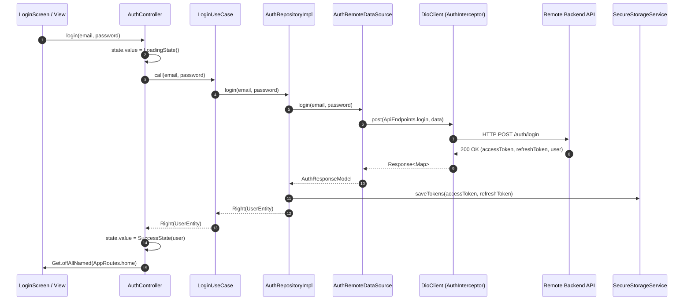
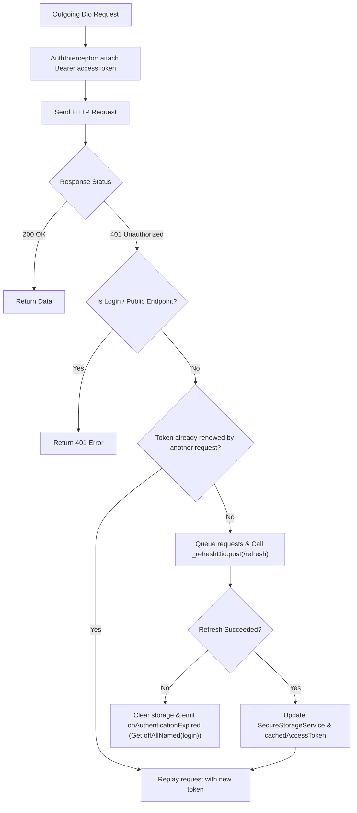

# Design Specification: Flutter Base Project Scaffolding

**Date:** 2026-09-10  
**Target Specification:** [`.agents/rules/flutter-base-project-prompt.md`](file:///Users/fazlerabbi/Desktop/Projects/building_utility_management_system/.agents/rules/flutter-base-project-prompt.md)  
**Status:** Approved by User / Ready for Implementation Planning  

---

## 1. Overview & Objectives

The goal is to scaffold the complete Flutter production base architecture for `building_utility_management_system` following the exact standards, folder structure, coding conventions, and verification gates established in [`.agents/rules/flutter-base-project-prompt.md`](file:///Users/fazlerabbi/Desktop/Projects/building_utility_management_system/.agents/rules/flutter-base-project-prompt.md).

### Core Directives & Hard Constraints
1. **Clean Architecture Isolation**: Strict separation of concerns across `core/`, `app/`, and `features/`.
2. **Pure Dart Domain Layer**: Domain entities, usecases, and repository contracts contain zero dependencies on Flutter, GetX, Dio, or JSON serialization packages.
3. **Unified Dependency Injection**: Exclusively use GetX Bindings (`InitialBinding` for permanent singletons, route-scoped `Bindings` for feature injection). Strictly zero references to `get_it` or `injectable`.
4. **Resilient Networking**: Complete Dio client configured with `QueuedInterceptorsWrapper` for race-condition-safe token refresh using an isolated `_refreshDio` instance without recursive loops.
5. **Robust State Modeling**: Reactive state using `sealed class ViewState extends Equatable` in `GetxController` rendered via targeted `Obx` widgets.
6. **Code-Generated Serialization**: All DTOs use `@JsonSerializable()` with generated `*.g.dart`. Zero hand-written JSON parsing.
7. **Official Localization**: Official Flutter intl + `.arb` catalogs (`app_en.arb`, `app_bn.arb`) with `context.l10n` access and dynamic locale switching.
8. **100% Green Verification Gates**: Zero warnings or errors in `flutter analyze --fatal-infos` and 100% passing tests in `flutter test`.

---

## 2. System Architecture & Folder Layout

```
lib/
├── app/
│   ├── app.dart                   # ScreenUtilInit + GetMaterialApp root widget
│   ├── bootstrap.dart             # Storage init, InitialBinding & error catching
│   └── flavors/
│       └── app_flavor.dart        # Dev, Staging, Prod environment configs
├── core/
│   ├── base/
│   │   └── view_state.dart        # Sealed ViewState (Idle, Loading, Success, Error)
│   ├── constants/
│   │   ├── api_endpoints.dart     # Centralized backend URL endpoints
│   │   ├── app_assets.dart        # Static asset paths
│   │   └── storage_keys.dart      # Hive boxes and secure storage keys
│   ├── error/
│   │   ├── exceptions.dart        # Low-level infrastructure exceptions
│   │   └── failures.dart          # Typed domain failures (fpdart Either)
│   ├── localization/
│   │   ├── l10n/
│   │   │   ├── app_en.arb         # English translations template
│   │   │   └── app_bn.arb         # Bangla translations
│   │   ├── app_localizations.dart # Generated localization class
│   │   └── l10n_ext.dart          # BuildContext extension (context.l10n)
│   ├── network/
│   │   ├── dio_client.dart        # Central Dio wrapper with timeouts & headers
│   │   ├── network_info.dart      # Connectivity checker contract & impl
│   │   └── interceptors/
│   │       ├── auth_interceptor.dart         # Queued token refresh interceptor
│   │       ├── connectivity_interceptor.dart # Pre-flight internet check
│   │       ├── error_interceptor.dart        # Maps DioExceptions to typed Failures
│   │       └── logging_interceptor.dart      # Safe console logging in debug mode
│   ├── routing/
│   │   ├── app_pages.dart         # GetPage route definitions with bindings & guards
│   │   ├── auth_middleware.dart   # Route guard verifying token presence
│   │   └── route_names.dart       # Type-safe string route constants
│   ├── storage/
│   │   ├── local_cache_service.dart    # Hive service for preferences, theme & locale
│   │   └── secure_storage_service.dart # FlutterSecureStorage for JWT tokens
│   ├── theme/
│   │   ├── app_colors.dart        # Constant semantic palette
│   │   ├── app_dimens.dart        # ScreenUtil responsive dimensions
│   │   ├── app_text_styles.dart   # Scaled text typography
│   │   └── app_theme.dart         # Light & Dark Material 3 ThemeData
│   ├── utils/
│   │   ├── extensions/
│   │   │   └── context_ext.dart   # Context helper extensions
│   │   └── formatters/            # Date & currency formatters
│   └── widgets/
│       ├── app_button.dart        # Standard responsive action button
│       ├── app_text_field.dart    # Standard styled input field
│       └── loading_overlay.dart   # Reusable progress indicator
├── features/
│   └── auth/
│       ├── data/
│       │   ├── datasources/
│       │   │   ├── auth_local_data_source.dart
│       │   │   └── auth_remote_data_source.dart
│       │   ├── models/
│       │   │   ├── auth_response_model.dart
│       │   │   └── user_model.dart
│       │   └── repositories/
│       │       └── auth_repository_impl.dart
│       ├── domain/
│       │   ├── entities/
│       │   │   └── user_entity.dart
│       │   ├── repositories/
│       │   │   └── auth_repository.dart
│       │   └── usecases/
│       │       └── login_usecase.dart
│       └── presentation/
│           ├── bindings/
│           │   └── auth_binding.dart
│           ├── controllers/
│           │   └── auth_controller.dart
│           └── screens/
│               └── login_screen.dart
├── main_dev.dart                  # Dev flavor entry
├── main_staging.dart              # Staging flavor entry
└── main_prod.dart                 # Production flavor entry
```

---

## 3. Dependency Specification (`pubspec.yaml`)

```yaml
name: building_utility_management_system
description: "Production Building Utility Management System built on Flutter Clean Architecture."
publish_to: 'none'
version: 1.0.0+1

environment:
  sdk: ^3.12.2

dependencies:
  flutter:
    sdk: flutter
  flutter_localizations:
    sdk: flutter

  # State Management & Routing
  get: ^4.6.6

  # Networking
  dio: ^5.4.0
  connectivity_plus: ^6.0.3

  # Functional Programming & Equality
  fpdart: ^1.1.0
  equatable: ^2.0.5

  # Storage & Caching
  flutter_secure_storage: ^9.2.2
  hive: ^2.2.3
  hive_flutter: ^1.1.0

  # UI, Theming & Typography
  flutter_screenutil: ^5.9.3
  google_fonts: ^6.2.1
  cupertino_icons: ^1.0.8

  # Localization & Formatting
  intl: ^0.19.0

  # Utilities & Environment
  logger: ^2.2.0
  flutter_dotenv: ^5.1.0
  json_annotation: ^4.9.0

dev_dependencies:
  flutter_test:
    sdk: flutter
  flutter_lints: ^6.0.0
  mocktail: ^1.0.4
  build_runner: ^2.4.9
  json_serializable: ^6.8.0

flutter:
  uses-material-design: true
  generate: true
  assets:
    - assets/icons/
    - assets/images/
    - assets/env/
```

---

## 4. Architectural Data Flow & Interceptor Pipeline

### Request & Refresh Sequence



### Token Refresh Pipeline



---

## 5. Verification & Quality Gates

The implementation will be verified against strict automated quality gates:

1. **Localization Gate**:
   ```bash
   flutter gen-l10n
   ```
   *Pass criteria*: `app_localizations.dart` generated without missing keys.
2. **Code Generation Gate**:
   ```bash
   dart run build_runner build --delete-conflicting-outputs
   ```
   *Pass criteria*: All models (`user_model.g.dart`, `auth_response_model.g.dart`) generated cleanly.
3. **Static Analysis Gate**:
   ```bash
   flutter analyze --fatal-infos
   ```
   *Pass criteria*: 0 errors, 0 warnings, 0 infos.
4. **Automated Unit Testing Gate**:
   ```bash
   flutter test
   ```
   *Pass criteria*: All tests pass 100% green.
