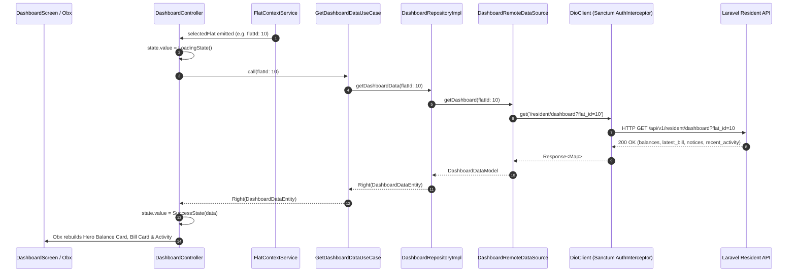

# Design Specification: Resident Dashboard Hub & Multi-Flat Navigation (Phase 1)

**Date:** 2026-09-10  
**Target Project:** `building_utility_management_system`  
**Backend Reference:** `tonmoy/build-utility-accounts-system` (`/api/v1/resident/*`)  
**Status:** Approved by User / Ready for Implementation Planning  

---

## 1. Overview & Business Intent

The goal is to implement **Phase 1** of the Resident Mobile Application:
1. **Persistent Root Navigation Shell**: 4-tab Material 3 navigation bar (`Home/Dashboard`, `Bills`, `Payments`, `Maintenance`) using `IndexedStack` to preserve state.
2. **Global Flat Context**: Multi-flat resident switcher (`FlatContextService`) allowing owners/tenants with multiple flats across buildings to switch active context seamlessly.
3. **Live Resident Dashboard**: Real-time financial summary reflecting the backend double-entry ledger (`total_due`, `advance_held`, `current_month_charges`, `arrears`), latest monthly bill status, active building notices, recent payment submissions, and quick action shortcuts.
4. **Auth Alignment**: Connect the existing authentication slice directly to the Laravel Sanctum backend API (`POST /api/v1/auth/login`), saving the bearer token and initial assigned flats.

---

## 2. Core Constraints & Architectural Standards

- **Strict Clean Architecture**:
  - `domain`: Pure Dart entities and usecases. Zero dependencies on Flutter, GetX, Dio, or JSON libraries.
  - `data`: Infrastructure implementations (`@JsonSerializable()` DTOs, remote data source via Dio, repository implementations).
  - `presentation`: UI widgets, screens, and controllers observing `ViewState` sealed classes.
- **Dynamic Ledger Integrity**: Financial figures (`total_due`, `advance_held`, etc.) are never statically stored or mocked in client cache; they are fetched dynamically from the backend `JournalService`.
- **Localization**: Official Flutter intl (`app_en.arb`, `app_bn.arb`) with 100% key parity for both English and Bangla.
- **Zero Warnings**: `flutter analyze --fatal-infos` must remain 100% green (0 errors, 0 warnings, 0 infos).
- **100% Passing Tests**: All unit and widget tests must pass via `flutter test`.

---

## 3. Directory Layout & Components

```
lib/
├── core/
│   ├── constants/
│   │   └── api_endpoints.dart         # Added /resident/flats, /resident/dashboard, etc.
│   └── localization/l10n/
│       ├── app_en.arb                 # English dashboard & navigation strings
│       └── app_bn.arb                 # Bangla dashboard & navigation strings
├── shared/
│   ├── domain/
│   │   └── entities/
│   │       └── flat_entity.dart       # Pure Dart FlatEntity
│   ├── data/
│   │   └── models/
│   │       └── flat_model.dart        # FlatModel @JsonSerializable
│   └── services/
│       └── flat_context_service.dart  # Global GetxService for active flat management
├── features/
│   ├── auth/                          # Aligned with Laravel Sanctum API
│   │   ├── data/datasources/auth_remote_data_source.dart
│   │   └── data/models/auth_response_model.dart
├── features/
│   ├── navigation/
│   │   └── presentation/
│   │       ├── bindings/navigation_binding.dart
│   │       ├── controllers/navigation_controller.dart
│   │       ├── screens/navigation_screen.dart
│   │       └── widgets/flat_selector_bottom_sheet.dart
│   └── dashboard/
│       ├── domain/
│       │   ├── entities/
│       │   │   ├── resident_balances_entity.dart
│       │   │   ├── latest_bill_entity.dart
│       │   │   ├── notice_snippet_entity.dart
│       │   │   └── dashboard_data_entity.dart
│       │   ├── repositories/dashboard_repository.dart
│       │   └── usecases/
│       │       ├── get_resident_flats_usecase.dart
│       │       └── get_dashboard_data_usecase.dart
│       ├── data/
│       │   ├── datasources/dashboard_remote_data_source.dart
│       │   ├── models/
│       │   │   ├── resident_balances_model.dart
│       │   │   ├── latest_bill_model.dart
│       │   │   ├── notice_snippet_model.dart
│       │   │   └── dashboard_data_model.dart
│       │   └── repositories/dashboard_repository_impl.dart
│       └── presentation/
│           ├── bindings/dashboard_binding.dart
│           ├── controllers/dashboard_controller.dart
│           ├── screens/dashboard_screen.dart
│           └── widgets/
│               ├── balance_hero_card.dart
│               ├── latest_bill_card.dart
│               ├── notices_banner_widget.dart
│               ├── quick_actions_row.dart
│               └── recent_activity_list.dart
```

---

## 4. Architectural Data Flow



---

## 5. Screen Layout & User Interaction

### App Bar & Flat Switcher
- The App Bar contains an interactive Flat Picker chip showing `Flat <number> • <building_name> ▾`.
- Tapping opens `FlatSelectorBottomSheet` displaying all flats associated with the authenticated resident.
- Selecting another flat updates `FlatContextService.selectFlat(flat)` and writes the selection to `LocalCacheService`.
- Dependent controllers instantly re-query for the newly selected flat.

### Dashboard Body (Pull-to-refresh enabled)
1. **Hero Balance Card**:
   - Distinctive gradient card showing `Total Outstanding Due` or a green "All Clear / Paid" badge.
   - Advance Balance badge (if any advance is held in double-entry account).
   - Monthly breakdown: `Current Month Charges` and `Arrears`.
   - "Pay Now" action button.
2. **Quick Actions Row**:
   - "Submit Payment" (triggers payments flow).
   - "View Bills" (switches to Tab 1).
   - "New Ticket" (switches to Tab 3).
3. **Latest Bill Card**:
   - Bill number, billing month, due date, status pill, and direct breakdown view link.
4. **Notice Board Preview**:
   - Pinned/emergency announcements banner with high visual priority.
5. **Recent Activity / Submissions**:
   - Recent payment verification status (`Pending`, `Verified`, `Rejected`) and maintenance updates.

---

## 6. Verification Plan & Test Strategy

### Automated Verification Gates
1. **Localization**: `flutter gen-l10n` — all keys valid in English and Bangla.
2. **Code Generation**: `dart run build_runner build --delete-conflicting-outputs` — clean generation for models.
3. **Static Analysis**: `flutter analyze --fatal-infos` — zero warnings/errors.
4. **Automated Unit & Widget Tests**: `flutter test`
   - Test `FlatContextService` switching and persistence.
   - Test `DashboardRemoteDataSource` and `DashboardRepositoryImpl`.
   - Test `GetDashboardDataUseCase` and `GetResidentFlatsUseCase`.
   - Test `DashboardController` state transitions (`LoadingState`, `SuccessState`, `ErrorState`).
   - Widget tests for `NavigationScreen` (tab switching) and `DashboardScreen` (rendering balances and cards).
